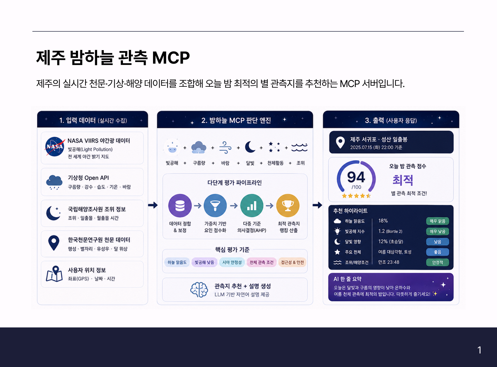

# 제주 밤하늘 관측 MCP

날짜: 2026년 7월 16일
사람: 김 이슬
선택: 개인MCP



# 먼저 읽기 — 기본 개념 7가지

이 문서에는 천문·광학 용어가 나온다. 아래 7가지만 알면 나머지는 따라 읽을 수 있다.

### 1. 밝기를 나타내는 숫자가 두 개고, 둘 다 거꾸로다

가장 헷갈리는 지점이라 먼저 정리한다.

| | 무엇을 재나 | 방향 | 범위 |
| --- | --- | --- | --- |
| **등급(mag)** | 별·천체 **하나**의 밝기 | **작을수록 밝다** | 시리우스 −1.5 … 맨눈 한계 6 |
| **SQM** | **하늘 배경**이 얼마나 어두운가 | **클수록 어둡다** | 도시 18 … 세계 최상급 22 |

둘이 서로 반대 방향인 게 함정이다.
- 등급은 고대 그리스에서 **가장 밝은 별을 1등성**이라 부른 데서 유래했다. 그래서 밝을수록 숫자가 작다.
- SQM은 하늘 배경을 같은 등급 체계로 표현한 것이라, 배경이 **어두울수록** 숫자가 크다.

**둘 다 로그 눈금이다.** 5등급 차이 = 정확히 100배. 그래서 "SQM이 3% 올랐다" 같은 표현은 성립하지 않는다. (문서가 증가율을 말할 때 항상 "복사휘도 기준"이라고 붙이는 이유)

### 2. "땅이 밝다"와 "하늘이 밝다"는 다른 문제다

이 프로젝트가 위성 데이터를 두 종류 쓰는 이유다.

- **VIIRS 야간광** — 위성이 위에서 내려다본 **지상의 불빛**. "저쪽에 도시가 있다"
- **Sky Brightness (SQM)** — 사람이 아래에서 올려다본 **하늘의 밝기**. "여기 하늘이 뿌옇다"

가로등 자체의 위치가 VIIRS이고, 그 빛이 공기 중에 퍼져 만든 뿌연 하늘이 SQM이다. **내가 선 자리에 불빛이 하나도 없어도 10km 옆 도시의 빛이 하늘을 밝히면 별은 안 보인다.**

→ 그래서 **"여기가 좋은 곳인가"는 SQM으로, "어느 쪽을 볼까"는 VIIRS로** 판단한다.

### 3. 별이 보이는 조건은 밝기가 아니라 대비다

별이 아무리 밝아도 배경이 더 밝으면 안 보인다. 낮에 별이 안 보이는 이유가 정확히 이것이다 — 별은 그대로 떠 있다.

그래서 이 문서가 다루는 방해 요인이 전부 하나로 모인다.

```
광공해 → 배경을 밝힘
달빛   → 배경을 밝힘
습도   → 빛을 산란시켜 배경을 밝힘
구름   → 별빛 자체를 가림
```

**한계등급**은 이 대비 계산의 결론이다. "오늘 이 자리에서 몇 등급까지 보이는가"를 숫자 하나로 답한 것.

### 4. 넓은 천체와 점 천체는 기준이 다르다

직관에 반하는 부분이라 예를 든다.

| 천체 | 등급 | 크기 | 맨눈으로 |
| --- | --- | --- | --- |
| 안드로메다 은하 | 3.4 (밝음) | 보름달 6개 늘어놓은 길이 | 아주 어두운 곳에서 겨우 |
| 고리성운 | 8.8 (어두움) | 보름달의 1/20 | 안 보임 (망원경 필요) |

등급은 **천체가 내는 빛의 총량**이다. 그 빛이 넓게 퍼지면 한 점당 밝기는 옅어진다. **물감 한 방울을 종이 전체에 펴 바르면 거의 안 보이지만, 한 점에 찍으면 진한 것**과 같다.

이 "펴 발랐을 때의 진하기"가 **면밝기(surface brightness)** 다. 성운·은하처럼 넓은 천체는 등급이 아니라 면밝기로 판정해야 한다.

### 5. 낮게 뜬 천체는 공기를 더 많이 통과한다

머리 위(천정)를 볼 때 통과하는 공기의 양을 1로 두면, 비스듬히 볼수록 그 양이 늘어난다. 이 배수가 **대기량(airmass)** 이다.

```
고도 90° (머리 위)     → 대기량 1.0
고도 30°               → 대기량 1.9
고도 10° (지평선 근처)  → 대기량 3.8
```

공기를 더 통과하면 ① 천체가 어두워지고 ② 광공해도 더 심하게 산란된다. 그래서 같은 천체라도 **낮게 떠 있으면 흐릿하다.** 문서가 고도 10° 아래를 아예 제외하는 이유다.

### 6. 구름은 "얼마나 꼈나"보다 "어느 높이인가"

- **낮은 구름 (3km 이하)** — 사실상 불투명하다. 빛을 **수만 분의 1**로 줄인다. 끼면 끝
- **높은 구름 (8km 이상, 권운)** — 대부분 얇아서 빛을 **3/4쯤 통과**시킨다. 밝은 별·행성은 그대로 보이고 은하수만 흐려진다

그래서 "총 운량 40%"라는 숫자 하나로는 판단이 안 된다. 40%가 전부 낮은 구름이면 관측 불가, 전부 높은 구름이면 관측 가능이다.

### 7. 모든 숫자에는 "어느 규약이냐"가 붙어 있다

문서가 반복해서 **"섞어 쓰지 말 것"** 이라고 경고하는 이유다.

같은 "22.00등급"이라도 어떤 기준값(영점)을 쓰느냐에 따라 실제 밝기가 1.6% 달라지고, 같은 "한계등급"이라도 관측자가 숙련자냐 아니냐에 따라 0.6등급쯤 차이 난다.

각 모델은 **자기 규약 안에서는 정확**하다. 문제는 A 모델의 값과 B 모델의 값을 섞을 때 생긴다.

→ 문서에 "영점", "밴드", "관측자 계수 F" 같은 말이 나오면 전부 이 이야기다.

---

# 생각해봐야할 것들

<aside>

- **좋은 관측지란?**
    
    **"좋은 관측지": 어둡기 ≠ 전부**
    
    하늘이 어두운 것과 실제로 별 보기 좋은 건 다름
    
    - 시야 트임: 사방이 막힌 골짜기는 어두워도 하늘이 조금만 보임. 오름 정상·능선은 개활도가 좋음.
    - 접근성·안전: 밤에 갈 수 있나, 주차 되나, 위험하지 않나.
    - 바다 위·군사지역·사유지: 어둡다고 갈 수 있는 게 아님.
    
    위험성도 함께 고려가 되어야 함
    
</aside>

# 시스템데이터

사용자는 세 가지 방식으로 질문함. **평가 엔진은 하나로 두고 입력을 좌표로 정규화**하는 구조.

```jsx
① "33.44, 126.836"     ┐
② "성산일출봉 근처"        ├→ [지오코딩] → 좌표 → [평가 엔진] → 결과
③ "이 루트 끝에서"        ┘                       ↑
                                           [후보 탐색]으로 좌표를 먼저 찾음
```

| 입력 유형 | 처리 |
| --- | --- |
| **좌표 직접** | 바로 평가 |
| **지명·주소** | 지오코딩으로 좌표 변환 후 평가 |
| **경로·범위** | 후보 탐색(`analysis_area`) → 상위 지점들을 각각 평가 |

# MCP 도구 구성

| 도구 | 입력 | 하는 일 |
| --- | --- | --- |
| `evaluate_spot` | 좌표 또는 지명 + 날짜 | 한 지점 평가 (핵심) — "여기 오늘 밤 괜찮아?" |
| `find_spots` | 중심좌표 + 반경(또는 bbox) + 커서 | 후보 탐색 + 랭킹 — "이 근처에 어디가 좋아?" |
| `tonight_sky` | 좌표 + 날짜 | 장소 평가 없이 천체 목록만 — "뭐가 보여?" |

→ 엔진은 공유하고 **진입점만 다른** 구조. `find_spots`가 후보를 찾으면 각각에 `evaluate_spot`을 적용함

**무상태(stateless) 설계 원칙**
MCP 안정 버전은 2025-11-25이나, 2026-07-28 개정안에서 **프로토콜 계층의 세션과 `Mcp-Session-Id` 헤더가 제거**됨.
따라서 `find_spots`의 페이지네이션은 **서버가 후보 목록을 세션에 들고 있는 방식으로 구현하지 않음.**
검색 조건·오프셋을 인코딩한 **불투명 커서 문자열을 응답에 담아 반환하고, 다음 호출의 인자로 되돌려받는** 방식으로 처리함.
전송은 단일 엔드포인트 Streamable HTTP(`/mcp`). 온프레 서버를 외부 LLM이 호출하는 구조이므로 stdio는 선택지가 아님.

**오케스트레이션은 서버 내부에서 수행**
"시간 → 천체 → 날씨 → 관측지"의 다단 툴 체인은 데모로는 유효하나, 외부 LLM이 순서를 바꾸거나 중간 단계를 건너뛰면 **결과가 조용히 틀림.**
실사용 경로는 `evaluate_spot` **1회 호출**로 내부에서 전 과정을 수행하고, LLM에는 판단이 아니라 표현만 맡김.
시연이 필요하면 `find_spots` → `evaluate_spot` 2단계까지가 실용과 시연의 접점.

**응답 스키마 규약**

- `response_format: "concise" | "detailed"` — 툴 응답은 25,000토큰 이하 권장. `find_spots`가 후보 20개에 전체 필드를 반환하면 컨텍스트 낭비
- `verdict` / `reasons[]` / `numbers{}` 를 **분리된 구조화 필드**로 반환 — LLM이 숫자를 지어낼 여지를 줄임
- `attribution: string[]` 을 **최상위 필드**로 두고, 도구 description에 "MUST be surfaced verbatim, MUST NOT be summarized or omitted" 명시
(외부 LLM이 응답을 재구성하면서 데이터 귀속 표기를 누락하는 문제에 대한 대응)
- 에러 메시지도 프롬프트로 취급 — "좌표가 제주 범위를 벗어났습니다. 위도 33.1–33.6, 경도 126.1–127.0

**우선순위 파라미터**`find_spots(priority = "darkness" | "safety" | "balanced")`
관광 위험 인식 연구는 지각된 위험·안전 수준이 목적지 **방문의도보다 회피의도를 더 강하게 예측**함을 보였고(Sönmez & Graefe 1998),
같은 목적지에 대해서도 이용자가 주목하는 위험 차원이 균질하지 않아 **위험 인식에 따라 복수의 이용자 군집으로 나뉨**을 밝힘(Roehl & Fesenmaier 1992).
즉 안전 요인은 이용자에 따라 가중치가 다르며, 특히 **기피 방향으로 강하게 작용**함.
따라서 어둡기와 접근성의 가중치는 **시스템이 정하지 않고 파라미터로 노출**함.

### 후보 탐색 절차 (`find_spots`)

루트 끝에서 별 보기 좋은 곳 같은 요청은 한 점 평가가 아니라 **탐색**

1. **범위 결정:** 종점 좌표 중심 반경 N km (또는 경로 회랑)
2. **래스터 훑기:** Sky Brightness 픽셀을 SQM 순 정렬. 900m 격자이므로 반경 10km ≈ 약 400픽셀, **연산 부담 없음**
3. **걸러내기: 바다 제외 / 체류 시설이 없는 곳 제외 / 한라산 탐방로 구역 제외**
4. **상위 후보 반환** (페이지네이션)

래스터에서 가장 어두운 픽셀은 대개 사람이 갈 수 없는 곳임. 실제로 본 프로젝트 데이터에서 가장 어두운(SQM 최댓값 21.93) 픽셀은 **바다 위**(33.0°N/127.07°E 외해). 필터가 없으면 한라산 백록담이 가장 어둡습니다 같은 결과가 나옴.

→ **경로 입력 처리**: 현실적으로는 **종점 반경 탐색**으로 시작. 대부분의 실사용이 "○○ 갔다가 근처에서 별 보고 싶다" 형태이기 때문. 출발–도착 회랑 탐색은 확장 과제.

```jsx
큐레이션 관측지 DB(30~50개) → 래스터로 랭킹 → 실시간 조건으로 재정렬
```

- 래스터 최댓값은 해상이고 그 다음은 한라산임. **필터가 본체이고 래스터는 보조**인데, 필터(체류시설·야간출입·통제)는 전부 불확실한 외부 데이터라 전수 탐색할수록 걸러야 할 오탐이 늘어남
- 큐레이션 DB에는 **개활도 프로파일을 사전 계산해 저장**할 수 있음(래스터 탐색으로는 불가능)
- 야간 출입 판정을 **유한한 집합에 대해서만** 하면 되므로 5장의 리스크가 관리 가능한 크기로 줄어듦
- 응답 품질 상승 — "126.72, 33.41 지점" 대신 "○○오름 주차장"을 반환

# 활용 데이터

## 0) 데이터 갱신

| 계층 | 정의 | 저장 위치 | 갱신 |
| --- | --- | --- | --- |
| **T0 정적** | 사실상 안 변함 | 이미지에 포함 | 연 1회 ~ 고정 |
| **T1 배치** | 느리게 변함 | 로컬 파일 / DB | 3시간 ~ 월 1회 |
| **T2 실시간** | 요청 시 조회 | 캐시 | TTL 기반 |

| 데이터 | 계층 | 갱신 주기 | 근거 |
| --- | --- | --- | --- |
| Sky Brightness GeoTIFF | T0 | 연 1회 | 도시 확장·가로등 증설은 수년 단위 |
| VIIRS 야간광 GeoTIFF | T0 | 연 1회 | 동일 |
| VIIRS 무운일수(CVG) | T0 | 연 1회 | 기후 통계 |
| Copernicus GLO-30 DEM | T0 | 고정 | 지형 |
| de421.bsp / OpenNGC / 항성표 | T0 | 고정 | 궤도·카탈로그 |
| 로컬 가제티어 | T0 | 반기 | 관광지 목록 |
| 지평선 프로파일(사전 계산) | T0 | 후보 추가 시 | 지형 파생물 |
| 큐레이션 관측지 DB | T0 | 수동 | 검증 기반 |
| **기상 예보** | **T1** | **3시간** | 아래 참조 |
| **대기질(PM2.5)** | **T1** | **3시간** | 기상과 동일 배치 |
| **규제 blocklist** | **T1** | **월 1회** | 고시·자연휴식년제 변동 |
| **도로 공사·장기통제** | **T1** | **주 1회** | 공사 구간은 주 단위 변동 |
| **도로 결빙 주의구간** | **T1** | 겨울철 일 1회 | 아래 주의 참조 |

→ **결과적으로 요청 시 외부 호출이 필요한 축이 하나도 남지 않는다.** 전부 로컬 조회로 처리됨.

### 기상을 실시간이 아니라 배치로 처리하는 근거

**① "해당 시각의 데이터"는 별도 호출이 아니다.**

시간별 예보를 한 번 받으면 **관측 창 전체가 그 안에 들어 있다.**

```jsx
21:20 밤 시작 ─────────────────────── 03:58 천문박명
   └─ 이 6시간 38분이 한 번의 호출 결과에 전부 포함
```

Open-Meteo는 hourly로 7일치, 기상청 단기예보는 1시간 단위로 글피까지 제공한다. 22:43 시점 데이터를 보려고 22:43에 호출할 필요가 없다. 또한 관측은 본래 미리 계획하는 활동이므로("오늘 밤 어때?"를 낮에 질의) 실시간성 요구가 더 낮다.

**② 제주 전역이 격자 100여 개에 불과하다.**

```jsx
제주 본섬 약 73km(동서) × 31km(남북)
÷ 5km 격자  →  15 × 7 ≈ 105격자 (주변 여유 포함 약 120)
```

기상청 단기예보는 전국을 5km × 5km 격자 37,697개로 나누어 제공하며, **3시간 간격으로 02·05·08·11·14·17·20·23시에 발표**한다. Open-Meteo도 좌표 리스트 및 **bounding box 일괄 조회**를 지원한다.

→ **발표 주기에 맞춰 제주 전역을 일괄 수집해 로컬에 저장하고, 조회는 로컬에서 수행한다.**

## 데이터 배치

```jsx
batch-worker (별도 컨테이너, 외부 통신 허용)
  ├─ 3시간  기상·대기질 격자 일괄 수집  → data/weather_YYYYMMDDHH.json
  ├─ 주 1회  도로 공사·통제 구간        → data/road_status.json
  ├─ 월 1회  규제 고시 변경 감지         → 알림만, 반영은 수동 검토 후
  └─ 연 1회  래스터 갱신                → data/*.tif (수동)
```

**MCP 서버 컨테이너는 배치 결과 파일을 읽기만 한다.** 외부 통신 책임이 워커로 격리되므로 MCP 서버의 egress를 0으로 유지할 수 있다.

규제 blocklist는 **자동 반영하지 않는다.** 워커는 변경 감지와 알림까지만 수행하고 반영 여부는 사람이 검토한다. 안전·법규 판정이므로 자동화 오류의 비용이 크다.

### 모든 T0·T1 데이터에 `as_of` 필수

사전 수집 데이터는 **언제 수집한 것인지**를 함께 저장한다

```jsx
{
  "as_of": "2026-07-15T20:00:00+09:00",
  "source": "제주도 고시 제2026-xxx호",
  "items": [ ... ]
}
```

- 판정 문구에 기준일자를 넣어야 하기 때문! "관측 가능"(X) **"2026-07-15 기준 확인된 통제 없음"(O)**

## 1) NASA VIIRS 기반 광공해 데이터

- **VIIRS/DNB 야간광 (Black Marble, VNP46A4/VJ146A4)** : 위성이 관측한 **지표에서 위로 나가는 빛의 양**. **그 지역이 얼마나 밝게 켜져 있나**. NASA 배포 원본.
- **Sky Brightness 모델** : 위 원본을 대기 산란까지 계산해 **실제로 하늘이 얼마나 밝게 보이나(SQM/Bortle)로 변환**한 것. NASA 제품이 아니라 **NASA VIIRS Black Marble 기반으로 lightpollutionmap.info가 산출한 레이어**임. (World Atlas 레이어를 쓸 경우 Falchi et al., 2016 인용 필요)

|  | Sky Brightness | VIIRS 야간광 |
| --- | --- | --- |
| 뜻 | 사람이 보는 **머리 위 하늘**의 밝기 | 위성이 보는 **지상의 불빛** |
| 답하는 질문 | **어디로 갈까** | **어느 방향을 볼까** |
| 값 | 인공 밤하늘 밝기 (mcd/m²) → SQM/Bortle | 복사휘도 (nW/cm²·sr) |
| 사용방식 | 좌표 1픽셀 조회 | 반경 내 광원을 방위별로 집계 |

Sky Brightness는 30초각 격자로 전 지구를 덮는 래스터라서, 위경도만 주면 그 지점의 픽셀 값을 읽어 "여기 하늘이 얼마나 어두운가"를 바로 계산할 수 있음. 30초각은 제주 위도(33.4°) 기준 **약 0.9km(남북) × 0.8km(동서)**.

→ **어떤 지역의 하늘 밝기는 도시가 확장되거나 가로등이 늘어야 바뀌는데, 이건 몇 달~몇 년 단위로 아주 천천히 움직임. 오늘 밤과 내일 밤의 서귀포 광공해는 사실상 동일**. 그러니 연 단위 데이터로도 "이 장소가 얼마나 어두운가"는 충분히 정확하게 답할 수 있음! (광공해 데이터가 실시간이지 않아도 되는 이유)

### 광공해 데이터를 어떻게 사용하는가? Sky Brightness (GeoTIFF)

→ **SQM은 사람이 보는 하늘의 밝기**

lightpollutionmap.info에서 GeoTIFF 원본 파일을 다운로드. 실시간 API가 아니라 연 단위로 갱신되는 정적 래스터. 인공 밝기(mcd/m²) 값이 들어있고, 공개된 변환식으로 SQM(하늘 밝기 등급) → Bortle 스케일로 바꿔서 사용 가능.

광공해 데이터의 경우 장소의 속성이기 때문에 **얼마나 어두운가에 대한 기준값**이 될 수 있음.

#### 변환식

> **쉽게 말하면** — GeoTIFF 파일에는 "인공 불빛이 하늘을 얼마나 밝혔나"가 물리 단위(mcd/m²)로 들어 있다. 여기에 **자연 밤하늘 자체의 밝기를 더해 총 밝기**를 구한 뒤, 사람이 쓰는 SQM 등급으로 바꾸는 과정이다. (개념 1번 참조)

```jsx
총밝기 = 인공밝기 + 0.171168465 (mcd/m², 자연 밤하늘 = 22.00 mag/arcsec²)
SQM   = log10(총밝기 / 108000000) / (-0.4)
Bortle = SQM 구간 매핑
```

주의해야할 점: 지도 팝업은 **μcd/m²**, GeoTIFF 값은 **mcd/m²** 1000배 차이. 594 μcd/m² = 0.594 mcd/m².

**자연 밤하늘 상수의 출처**
0.171168465는 본 문서가 채택한 영점 1.08×10⁸ mcd/m²에서 22.00 mag/arcsec²를 역산한 값임(`1.08e8 × 10^(−0.4×22) = 0.171168465`, 소수 9자리 일치).
Falchi et al. (2016)은 같은 22.0 mag/arcsec²에 대해 **174 μcd/m²**를 사용하며, 이는 영점 1.098×10⁸에 해당함. 두 규약은 **1.6% 차이**가 있음.

> "We chose 22.0 mag/arcsec², corresponding to 174 μcd/m², as a typical brightness of the night sky background during solar minimum activity, excluding stars brighter than magnitude 7, away from Milky Way and from Gegenschein and zodiacal light." (Falchi et al. 2016)

→ 어느 쪽이 틀린 게 아니라 **섞어 쓰면 틀림.** 본 프로젝트는 **영점과 자연광 상수를 한 쌍으로 고정**해 사용하고 두 규약을 혼용하지 않음. Falchi의 공개 등급 구간과 대조할 때는 절대 밝기가 아니라 **인공/자연 비율(ratio)로 변환해 비교**함. 비율은 영점 선택과 무관하게 불변이기 때문.

**영점 1.08×10⁸의 전제**
이 상수는 **9550 K 흑체 스펙트럼 · Johnson V 밴드**를 전제로 한 관용값임(Bará et al. 2017). 광원 색온도가 이와 다르면 mag↔휘도 변환에 계통 오차가 생기며, 2500 K 기준으로는 약 +13% 차이가 남. Garstang(1986) 원식은 10.85×10⁴를 사용함.
→ 한국은 LED 가로등 교체가 진행돼 실제 광원 스펙트럼이 이 전제에서 벗어나 있음. 이는 뒤에서 언급할 **VIIRS의 500nm 이하 저감도 문제와 같은 방향(모델이 실제보다 어둡게 나옴)으로 작용**하므로, 두 편향이 상쇄되지 않고 누적됨.

**nodata 처리 필수**
보유 GeoTIFF의 nodata 값은 **−999.9** (float32, EPSG:4326).
마스킹 없이 변환식에 넣으면 예외 없이 이상값이 산출되므로 명시적으로 걸러야 함.

```python
a = ds.read(1).astype('float64')
a[a <= -100] = np.nan          # nodata 마스킹
sqm = np.log10((a + 0.171168465) / 108000000) / -0.4
```

보유 데이터 사양: Sky Brightness 118×98 / 0.008333°(30초각), VIIRS 311×260 / 0.004167°(15초각).
제주 영역 SQM 분포는 min 19.14 / p25 21.12 / p50 21.50 / p95 21.86 / max 21.93 (해상 포함).

#### 예시 사진

[Light Pollution Map](https://www.lightpollutionmap.info/#zoom=7.74&lat=33.3791&lon=126.5460&state=eyJiYXNlbWFwIjoiTGF5ZXJCaW5nUm9hZCIsIm92ZXJsYXkiOiJzYl8yMDI1Iiwib3ZlcmxheWNvbG9yIjpmYWxzZSwib3ZlcmxheW9wYWNpdHkiOiI2MCIsImZlYXR1cmVzb3BhY2l0eSI6Ijg1In0=)


그림1. 제주의 Sky brightness

#### 그림1. GeoTIFF 값들에 대한 해석

- 그림1. GeoTIFF 값 해석
    
    > **SQM (Sky Quality Meter) 20.37 mag/arcsec²**
    > 
    - 밤하늘의 어두운 정도를 나타내는 가장 중요한 수치
    - **숫자가 클수록 하늘이 어둡고 별이 잘 보임**
        
        
        | SQM | 하늘 상태 |
        | --- | --- |
        | 22.0 | 매우 어두움 (산 정상급) |
        | 21.5 | 매우 좋은 시골 |
        | 21.0 | 좋은 시골 |
        | **20.3~20.5** | 보통 시골, 은하수는 보임 |
        | 19~20 | 교외 |
        | 18 이하 | 도시 |
    
    > **Brightness 0.766 mcd/m²**
    > 
    - 밤하늘 자체의 밝기(자연 + 인공). **낮을수록 어두운 하늘**
    
    > **Artificial Brightness 594 μcd/m²**
    > 
    - 인공조명(가로등, 건물 등) 때문에 생긴 밝기. 값이 **낮을수록 광공해가 적음**
        - GeoTIFF에 저장된 값 (mcd/m² 단위)
    
    > **Ratio = 3.48**
    > 
    - 자연적인 밤하늘보다 **약 3.5배 밝다**는 뜻. 완전한 자연 상태는 아님을 뜻함.
        - 계산: 0.594 / 0.171 ≈ 3.47
    
    > **Bortle Class 5**
    > 
    
    | 등급 | 의미 |
    | --- | --- |
    | 1 | 세계 최고 수준의 밤하늘 |
    | 2 | 매우 좋음 |
    | 3 | 은하수가 아주 선명 |
    | 4 | 은하수 잘 보임 |
    | **5** | **교외 수준. 은하수는 보이지만 디테일이 조금 줄어듦** |
    | 6 | 밝은 교외 |
    | 7~9 | 도시 |
    
    ⚠️ **Bortle(2001) 원문은 NELM과 서술적 기준으로 등급을 정의하며 SQM 경계값을 제시하지 않음.** 원문 전문을 확인한 결과 SQM 수치가 한 번도 등장하지 않음. 통용되는 SQM↔Bortle 대응표는 원 논문에 근거가 없고, lightpollutionmap이 링크하는 표는 개인 웹사이트 출처이며 구간 폭도 불균질함(Class 1은 0.01 mag, Class 4는 1.20 mag로 120배 차이).
    
    Crumey(2014)는 peer-reviewed 논문에서 이 척도를 직접 비판함 — Bortle 척도가 제시하는 **M33 가시성 권고가 자신의 모델과 모순**되며, "이 척도는 엄밀한 데이터가 아니라 주관적 판단에 기반한 것으로 보이므로 신뢰성이 의심스럽다(*its reliability appears questionable*)"고 기술함. 또한 Class 1의 권장 한계등급 7.6~8.0은 **순간적 깜빡임(scintillation)을 역치로 오인한 결과**일 수 있다고 지적함.
    
    → 본 프로젝트는 사용자 친숙도를 위해 Bortle을 **보조 표기로만** 유지하고 **lightpollutionmap.info 기준 매핑임을 명시**함. 판정의 주 기준은 아래 **Falchi 등급**을 사용함.
    
    > **Elevation**
    > 
    - 해발 92m. 고도가 높으면 저층 안개·구름 위로 올라갈 수 있고 시야 개활도가 좋아지는 경향이 있음. (광공해 값 자체와는 별개 변수)
    
    > **Timeline (+3.2%/year)**
    > 
    - 2012~2025년 동안의 변화. **복사휘도(radiance) 기준 연 약 3.2% 증가**
    - 같은 기간 SQM은 20.3 → 19.9로 낮아짐. SQM은 **낮아질수록 하늘이 밝아지는 것**이므로, 광공해가 악화되고 있다는 의미(SQM은 로그 단위이므로 "SQM이 몇 % 증가/감소"라는 표현은 쓰지 않음. %는 복사휘도 기준)
    - ⚠️ 이 값은 lightpollutionmap.info가 표시하는 **해당 픽셀 단일 지점의 타임라인 판독값**이며 논문에 보고된 통계가 아님. 참고로 Kyba et al. (2017)이 보고한 전 지구 야간광 증가율은 연 약 2.2%임. → **"제주 특정 지점에서 광공해가 악화 추세"라는 정성적 근거로만** 사용하고 예측·외삽에는 쓰지 않음

<aside>

광공해는 900m 격자의 모델값이라 지점 단위 정밀도는 없음. (**위경도별로 뽑아볼 순 있지만, 100m 옆은 같은 픽셀이라 값이 동일함**) → 이 한계는 지형·개활도 데이터로 보완.

</aside>

### 하늘 등급 표기 — Falchi 등급 (주 기준)

> **쉽게 말하면** — "이 하늘이 얼마나 오염됐나"를 등급으로 부르는 방법이다. 흔히 쓰는 Bortle 등급은 SQM 경계값의 출처가 불분명해서, 논문에 실린 **Falchi 등급을 주 기준**으로 쓴다. 판정 기준이 **"인공광이 자연광의 몇 배냐"** 라서 단위 규약(개념 7번)에 영향을 받지 않는 게 장점.

Bortle의 SQM 경계값은 1차 출처가 없으므로(위 참조), 판정의 주 기준은 peer-reviewed 등급 체계인 **Falchi et al. (2016)** 를 사용함.

이 체계는 인공 밝기를 **자연광 대비 비율**로 6단계 정의함. 원문 축어:

> (i) Up to 1% above the natural light (0 to 1.7 μcd/m²) — **pristine sky**
> (ii) From 1 to 8% above the natural light (1.7 to 14 μcd/m²) — relatively unpolluted at the zenith but degraded toward the horizon
> (iii) From 8 to 50% above natural nighttime brightness (14 to 87 μcd/m²) — polluted sky degraded to the zenith
> (iv) From 50% above natural to the level of light under which the Milky Way is no longer visible (87 to 688 μcd/m²) — natural appearance of the sky is lost
> (v) From Milky Way loss to estimated cone stimulation (688 to 3000 μcd/m²)
> (vi) Very high nighttime light intensities (>3000 μcd/m²) — night adaptation is no longer possible for human eyes

| 등급 | 인공/자연 비율 | 인공 밝기 | SQM(참고) | 의미 |
| --- | --- | --- | --- | --- |
| i | ≤ 1% | ~1.7 μcd/m² | 21.97~ | 원시 하늘(pristine) |
| ii | 1~8% | 1.7~14 | 21.90~21.97 | 천정은 비교적 깨끗, 지평선 쪽 열화 |
| iii | 8~50% | 14~87 | 21.54~21.90 | 오염된 하늘, 천정까지 열화 |
| iv | 50%~은하수 소실 | 87~688 | 20.25~21.54 | 하늘의 자연스러운 외관 상실 |
| v | 은하수 소실~추상체 자극 | 688~3000 | 18.83~20.25 | — |
| vi | > 3000 μcd/m² | >3000 | ~18.83 | 암순응 불가 |

**이 체계를 채택하는 이유**: 비율 기준이므로 **영점 규약(위 참조)과 무관하게 불변**임. 문서가 이미 산출하는 `Ratio` 값으로 추가 데이터 없이 바로 판정됨. SQM 열은 Falchi의 자연광 기준(174 μcd/m²)으로 환산한 **참고값**이며, 등급 판정은 비율로 함.

**제주 데이터 적용 결과**

| 지점 | SQM | 인공/자연 비율 | Falchi 등급 |
| --- | --- | --- | --- |
| 제주 p95 (최상위 육상급) | 21.86 | 0.12 | **iii** |
| 제주 중앙값 p50 | 21.50 | 0.56 | **iv** |
| 용눈이오름 예시 | 21.2 | 1.06 | **iv** |
| 제주시 수준 | 19.14 | 12.7 | **v** |

→ **주의해야 할 함의**: 대표 예시인 SQM 21.2는 인공광이 자연광의 **106%**, 즉 Falchi 등급 iv **"하늘의 자연스러운 외관 상실"** 구간임. 은하수 소실 임계(비율 3.95)보다는 아래이므로 **"은하수는 보인다"는 서술 자체는 유효**하나, "Bortle 4"라는 라벨이 주는 인상보다 실제 등급은 낮음. 결과 문구는 이에 맞춰 표기함.

[jeju_2025_GeoTIFF_raw.tif](sb_202500.tif)

Sky Brightness는 측정값이 아니라 모델값이며, 제작처가 다음 한계를 명시하고 있음.

- **모델링된 천정 밝기는 최상의 경우(best case scenario)를 나타내며 어디서나 100% 정확하지는 않음**
- VIIRS 데이터는 **현지 시각 01:30경에 수집**되므로 그 전후 시간대는 더 밝거나 어두울 수 있음 → 관측 시작 시각(21시대)과 다름
- VIIRS 검출기는 **500nm 이하에 사실상 반응하지 않아**, 강한 백색·청색 조명이 있는 곳은 실제 하늘이 모델 예측보다 훨씬 밝음
→ 한국은 LED 가로등 교체가 많이 진행되어 **실측이 모델보다 밝게 나올 가능성이 구조적으로 존재**
- 에어로졸 등 대기 상태의 영향으로 **완벽해 보이는 두 밤이 0.5등급씩 차이날 수 있음**
- **"모델 지도가 정말 잘하는 것은 다른 조건이 같을 때 한 장소를 다른 장소와 비교하는 일"**

→ 따라서 본 프로젝트는 **절대값 예측이 아니라 지점 간 상대 비교**로 포지셔닝함.
VIIRS 방위 프로파일에서 "절댓값은 의미 없으므로 상대 비교"라고 한 것과 동일한 논리를 SQM에도 일관되게 적용함.

### **야간광 데이터를 어떻게 활용하는가?** VIIRS

→ **VIIRS는 위성이 보는 지상의 불빛**

VIIRS는 좌표 하나를 찍어 읽는 데이터가 아니라, **주변을 훑어서 쓰는 데이터**. VIIRS 값이 낮아도 옆 도시가 밝으면 하늘은 나쁠 수 있음 why? 그 픽셀이 얼마나 켜져 있는지만 보는 값이기 때문. 따라서 **관측지 평가 기준은 Sky Brightness**, VIIRS는 **방위 분석·국지 광원 탐지용**으로 역할을 나눔.

보유 데이터를 직접 검증한 결과, **제주 영역 VIIRS 유효 픽셀의 71.9%가 값이 정확히 0**임.
NASA가 잔여 배경 노이즈 제거를 위해 **0.5 nW·cm⁻²·sr⁻¹ 미만의 복사휘도를 0으로 설정**하기 때문(Black Marble User Guide). 0이 대량으로 나타나는 1차 원인은 이 처리임.

단, **보유 래스터에는 0 < v < 0.5 구간의 픽셀도 3,864개(4.8%) 존재함.** 임계가 그대로 남아 있는 원본이라면 이 구간은 비어야 하므로, 보유 파일은 **재샘플링·보간을 거친 파생 산출물**로 판단됨. → 따라서 개별 픽셀의 절댓값을 신뢰하지 않고 **방위별 집계에만 사용**한다는 본 절의 원칙이 더욱 타당함.

| 주장 | 판정 |
| --- | --- |
| 도시 글로우의 **방위 판별** | ✅ 유효 (제주시·서귀포 등 밝은 광원은 살아 있음) |

제주 본섬 범위로 한정하면 5,088픽셀 중 **36.1%가 VIIRS 0**이고, 그 픽셀들의 실제 SQM은 20.86~21.85로 **약 1등급이 흩어져 있음.** 즉 관측지 후보가 될 어두운 지역에서 VIIRS는 서로 구별하지 못하며, 이 구간의 판정은 전적으로 Sky Brightness가 담당함.

#### a) 방위별 광공해 프로파일

> **쉽게 말하면** — 관측지를 중심으로 사방 30km의 불빛을 훑어서 "어느 쪽이 밝고 어느 쪽이 어두운지" 지도를 만든다. 가까운 불빛일수록 더 크게 치는데, **얼마나 더 크게 칠지(지수 p)** 를 정하는 게 아래에서 문제가 된다.

관측지를 중심으로 반경 30km 안의 VIIRS 픽셀을 훑어, 각 픽셀의 방위각과 거리를 구해 밝기를 가중 합산.

$$
섹터\ 점수(\theta) = \sum_{i \in \theta} \frac{V_i}{d_i^2 + \varepsilon}
$$

- $V_i$ = VIIRS 복사휘도, $d_i$ = 관측지로부터 거리(km), ε = 0 나눗셈 방지 상수
- 8~16방위로 집계 → "북 340 / 북동 120 / 남 12" → **가장 낮은 섹터가 오늘 밤 볼 방향**
- 절댓값은 의미 없으므로 최댓값으로 정규화해 상대 비교

실제 광공해 전파는 거리뿐 아니라 대기 상태·산란각·광원의 상향 발광 패턴에 의존하며, 정확한 계산에는 Garstang (1986) 계열의 점확산함수(PSF)가 필요함. 본 프로젝트는 **절대 밝기가 아닌 방위 간 상대 순위 비교**가 목적이므로 거리 제곱 반비례 근사를 사용함. 절대 하늘 밝기는 이미 해당 모델이 반영된 **Sky Brightness 레이어**가 담당.

**단, 이 근사의 한계는 순위에도 영향을 줌.** d⁻²는 문헌의 감쇠 지수 범위(대략 −2 ~ −3.33) 중 **가장 완만한 쪽**이므로 원거리 대광원의 기여가 과대평가됨. 30km 광원의 경우 d⁻²·⁵ 대비 약 5.5배 과대평가함. 제주는 북쪽 제주시·남쪽 서귀포라는 **원거리 대광원과 국지 소광원이 함께 존재**하므로, 지수를 바꾸면 방위 순위가 뒤집힐 수 있음. 따라서 "상대 비교가 목적이니 괜찮다"는 논거만으로는 방어되지 않음.

#### 민감도 검사 결과 (실측)

> **쉽게 말하면** — "거리가 2배 멀어지면 불빛 영향이 몇 분의 1이 되나"를 정하는 값이 지수 p다. 문헌마다 2~3.33으로 갈리는데, **어느 값을 쓰느냐에 따라 추천 방향이 정반대로 뒤집히는 지점이 제주에 42%나 있었다.** 그래서 여러 p를 다 돌려보고, 결과가 흔들리면 방향을 단정하지 않기로 했다.

보유 VIIRS 래스터로 제주 12개 지점에 대해 p = 2 / 2.25 / 2.5 / 2.75 / 3 / 3.33 을 실제로 돌려 확인함. 반경 30km, 16방위, ε = 0.01 km².

| 지점 | p별 추천 방위 | 최대 이동 | 판정 |
| --- | --- | --- | --- |
| 용눈이오름 | WSW → W | 22° | 안정 |
| 새별오름 | E | 0° | 안정 |
| 한라산 남사면 | ENE | 0° | 안정 |
| 금오름 | SW | 0° | 안정 |
| 제주시 인근 | S | 0° | 안정 |
| 표선 중산간 | N | 0° | 안정 |
| 송당 중산간 | ESE | 0° | 안정 |
| **성산일출봉** | **S → E** | **90°** | **불안정** |
| **산굼부리** | **SSE → S → N** | **180°** | **불안정** |
| **가시리 풍력** | **W → NNW** | **68°** | **불안정** |
| **저지오름** | **SW → ENE → SW** | **158°** | **불안정** |
| **안덕 중산간** | **SSE → ENE → NNE** | **135°** | **불안정** |

**12지점 중 5지점(42%)에서 추천 방위가 뒤집힘.** 산굼부리는 p = 2에서 남남동, p = 3.33에서 **정북** — 정확히 반대 방향을 추천함.

→ **"절댓값이 아니라 상대 순위 비교가 목적이므로 d⁻² 근사로 충분하다"는 기존 논거는 실측으로 반증됨.** 순위 자체가 지수에 의존함.

#### 채택 절차

$$
\text{섹터 점수}(\theta) = \sum_{i \in \theta} \frac{V_i}{d_i^{\,p} + \varepsilon}, \qquad \varepsilon = 0.01\ \text{km}^2
$$

1. **p를 전 구간 스캔**한다: p ∈ {2, 2.25, 2.5, 2.75, 3, 3.33}
2. 각 p에서 최암 방위를 구한다
3. 최암 방위의 최대 이동이 **1섹터(22.5°) 이하면 단일 방위를 추천**한다
4. 그보다 크면 **단일 방위를 추천하지 않고**, 모든 p에서 어두운 상위 4에 드는 **강건 집합**을 제시한다
   - 예) 산굼부리 → "S·E 방향이 상대적으로 어두우나 방위 간 차이가 뚜렷하지 않음"

⚠️ **양 끝점(p = 2, 3.33)만 비교하는 것으로는 불충분함.** 저지오름은 두 끝점이 모두 SW로 일치하지만 중간 p에서 ENE로 158° 벗어남(비단조). 반드시 전 구간을 스캔할 것.

**연산 비용은 무시 가능**: 12지점 × 6개 p = 0.13초. p를 1개만 쓰는 것 대비 6배지만 절대 시간이 작음.

**불안정의 원인**: 상위 방위들이 사실상 동점인 경우에 발생함(성산일출봉은 최암 S = 0.054, 차암 E = 0.058로 7% 차이). 다만 **여유비만으로는 판별되지 않음** — 가시리 풍력은 여유비 0.18로 여유가 큰데도 불안정함. 따라서 여유비 임계치가 아니라 **위 절차대로 실제로 p를 스캔**해야 함.

#### b) 천체 방위 × 광공해 방위 교차

천체 계산(Skyfield)으로 나온 대상 천체의 방위 × VIIRS 방위 프로파일을 교차.

ex) 토성이 남남동 고도 42°, 남남동은 어두움 → 이 관측지 적합

#### **c) 고도 가중**

> **쉽게 말하면** — 개념 5번(대기량) 이야기다. 같은 방향이라도 **높이 뜬 천체와 낮게 뜬 천체는 받는 피해가 다르다.** 남남동이 어둡다고 해도, 그 방향에 고도 12°로 낮게 뜬 천체는 여전히 흐릿하다.

**광공해는 지평선 근처에서 훨씬 심함.** 빛이 대기를 훨씬 긴 거리로 통과하기 때문. 따라서 같은 남남동이라도 고도 42°인 토성과 고도 12°인 천체는 받는 영향이 완전히 다름.

이 "대기 통과 거리"를 정량화한 것이 대기량(airmass, X)임. 천정에서 X = 1이고 지평선으로 갈수록 급증.

Krisciunas & Schaefer (1991)가 산란광 계산에 사용한 대기량 식:

$$
X = \left(1 - 0.96\sin^2 z\right)^{-0.5}
$$

- z = 천정거리 = 90° − 고도
- 산란광에 적합하도록 지평선 부근에서 값이 제한되는 형태

| 고도 | 천정거리 z | 대기량 X |
| --- | --- | --- |
| 90° | 0° | 1.00 |
| 60° | 30° | 1.15 |
| 40° | 50° | 1.51 |
| 30° | 60° | 1.89 |
| 25° | 65° | 2.17 |
| 20° | 70° | 2.56 |
| 10° | 80° | 3.81 |

위 값은 모두 본 식에 z를 직접 대입해 산출한 것임.

**참고 — 왜 표준 대기량보다 작은가**: 같은 고도에서 기하 대기량 sec z는 30°→2.00, 10°→5.76으로 훨씬 큼. K&S 식은 **산란광 계산용**이라 지평선 부근에서 의도적으로 값이 억제되도록 설계된 것이며, 이 차이는 오류가 아니라 용도 차이임. 천체 자체의 소광(extinction)을 계산할 때는 Kasten & Young(1989) 계열의 표준 대기량 식을 쓰는 것이 맞음.
→ 본 프로젝트에서 X는 **광공해·달빛 산란광의 고도 가중**에만 사용하므로 K&S 식으로 통일함.

$$
영향도=섹터 점수×X(고도)
$$

#### 예시 사진


그림2. 제주의 VIIRS

#### 그림2. 제주의 VIIRS 값들에 대한 해석

- VIIRS 값들에 대한 해석
    
    > **Value = 0.74 nW/cm²·sr**
    > 
    - 위성이 측정한 **그 지점의 인공조명 밝기. 값이 낮을수록 어두움**
    - 이 값은 "그 지점이 얼마나 켜져 있나"이지 "그 지점 하늘이 얼마나 어두운가"가 아님
        
        
        | VIIRS 값 | 의미 |
        | --- | --- |
        | 0 ~ 0.2 | 거의 암흑 (최고) |
        | 0.2 ~ 0.5 | 매우 어두움 |
        | **0.5 ~ 1.0** | 꽤 어두움  |
        | 1 ~ 3 | 교외 |
        | 3 ~ 10 | 도시 외곽 |
        | 10 이상 | 도심 |

[jeju_2025_viirs_npp.tif](viirs_npp_202500_(1).tif)

[viirs_npp_202500.tif](viirs_npp_202500.tif)

## 2) 천체데이터

| 데이터/라이브러리 | 형태 | 얻는 데이터 |
| --- | --- | --- |
| JPL de421.bsp (skyfield-data) | 로컬 파일 17MB | 해·달·행성 궤도 |
| Skyfield | 계산 엔진 | 고도·방위·박명 산출 |
| OpenNGC (pyongc) | 로컬 DB 5.5MB | 메시에 110개 좌표·등급·소속 별자리 |
| 항성 좌표표 | 코드 내 상수 | 밝은 별 20개 + 별자리 매핑 |
| KASI 출몰시각 API | REST | 계산 검증용 |

→ **de421·OpenNGC·항성표는 전부 파일/상수라 네트워크 불필요.** Docker 이미지에 그대로 구워지며 오프라인 동작 가능

Horizons와 de421.bsp는 동일한 JPL 천체력 계열이라 정밀도 이점이 없음. 반면 `analysis_area`처럼 다수 좌표를 격자 탐색하는 도구는 호출 횟수 제한·네트워크 지연으로 성립 불가. 또한 Horizons는 태양계 천체 전용으로 항성·별자리는 다루지 않음.

```
사용자 입력 (위경도 + 날짜)
   ↓
a) 관측 창 계산        ← Skyfield + de421
   ↓
b) 달 조건 계산        ← Skyfield + de421
   ↓
c) 하늘 배경 밝기 합산   ← Sky Brightness + 달빛(K&S 1991)
   ↓
d) 한계등급 산출        ← c) 결과 (Crumey 2014, F=2)
   ↓
e) 카탈로그 필터링      ← OpenNGC + 항성표
   ↓
f) 고도·방위 계산       ← Skyfield
   ↓
g) 별자리 그룹핑        ← 별자리 매핑 (항성표 내장)
   ↓
결과: 관측 창 + 보이는 별자리·천체 (방향 포함)
```

### a) 관측 창 계산

> **쉽게 말하면** — "오늘 밤 몇 시부터 몇 시까지가 진짜 관측 시간인가"를 구한다. **해가 지는 시각이 아니다.** 해가 진 뒤에도 한동안 하늘에 잔광이 남아서, 실제 관측 시작은 일몰보다 1시간 40분쯤 늦다.

해가 졌다고 바로 별이 보이지 않음. 해가 지평선 아래로 내려가도 대기 상층이 여전히 햇빛을 받아 하늘이 푸르스름하게 남아 있음. 이것을 **박명(twilight)**이라 하며, 해가 얼마나 깊이 내려갔느냐로 4단계를 구분함.

| 태양 고도 | 단계 | 하늘 상태 |
| --- | --- | --- |
| 0° ~ −6° | 시민박명 | 밖에서 신문을 읽을 수 있는 밝기 |
| −6° ~ −12° | 항해박명 | 수평선이 겨우 구분됨 |
| −12° ~ −18° | 천문박명 | 밝은 별은 보이나 하늘에 잔광 |
| **−18° 이하** | **밤(Night)** | **완전한 어둠. 은하수·성운 관측 가능** |

별 관측 기준은 **−18° 이하**임. 이 시점 전에는 어두운 천체가 잔광에 묻힘.

#### 계산법

태양의 고도를 시간축으로 훑으면서 −18°를 통과하는 순간을 찾음. 고도가 시간에 따라 연속적으로 변하므로, **구간을 반씩 좁혀가며(이분 탐색)** 정확한 시각을 특정함.

```python
tt, ev = almanac.find_discrete(t0, t1, almanac.dark_twilight_day(eph, site))
```

`ev` 값이 0~4로 반환되며 **0 = 완전한 밤**. 별 관측 기준 시작점.

ex) **결과** (용눈이오름 2026-07-19)

```
19:41 시민박명 → 20:09 항해박명 → 20:43 천문박명 → 21:20 밤                                       03:58 천문박명 → 04:34 항해박명
```

→ 관측 창 **21:20 ~ 03:58** (6시간 38분)

### b) 달 조건 계산(오늘 달이 얼마나 밝은지)

달은 밤하늘에서 압도적으로 밝은 광원임. 보름달이 뜬 밤에는 은하수가 아예 보이지 않음. **광공해가 아무리 낮은 장소라도 달이 밝으면 소용없음.** 달은 **관측 대상이면서 동시에 최대 방해물**이라는 이중성을 가짐.

- 달 조도(달 표면 중 빛나는 비율)
    
    태양–달–지구가 이루는 각도로 결정됨. 지구에서 볼 때 달의 몇 %가 햇빛을 받고 있는지를 기하학적으로 계산.
    
    ```jsx
    almanac.fraction_illuminated(eph, 'moon', t)   # 0.31
    ```
    
- **월몰 시각**(달이 지평선 아래로 내려가는 시각)
    
    달의 고도를 시간축으로 훑어 0°를 하향 통과하는 시점을 찾음. a)의 박명 계산과 같은 원리.
    
    ```python
    almanac.find_settings(here, eph['moon'], t0, t1)   # 22:43
    ```
    
- **달의 고도·방위** (c)의 각거리 계산에 필요)
    
    ```jsx
    alt, az, _ = here.at(t).observe(eph['moon']).apparent().altaz()
    ```
    

ex 결과) 조도 31%, 월몰 22:43 → 21:20~22:43은 달빛이 남아 있고, **22:43 이후가 진짜 최적 구간**

---

### c) 하늘 배경 밝기 합산, Krisciunas & Schaefer (1991)

> **쉽게 말하면** — 달이 얼마나 방해하는지를 계산한다. 핵심은 **달이 밝은가만이 아니라 보려는 천체와 얼마나 떨어져 있는가**가 중요하다는 것. 같은 반달이어도 대상 바로 옆에 있으면 치명적이고, 반대편 하늘에 있으면 영향이 거의 없다.

초기에는 `MAG_LIMIT = 6.0 - 3 × 달조도` 형태의 단순 근사를 사용했으나, 이는 **달 조도 하나만** 고려한 임의식임. 실제로는 같은 조도라도 **달이 관측 대상 바로 옆에 있으면 치명적이고, 반대편 하늘에 있으면 영향이 거의 없음.** 각거리를 무시하면 오차가 큼. (Krisciunas, K. & Schaefer, B. E. 1991, *A Model of the Brightness of Moonlight*, PASP, 103, 1033. DOI: 10.1086/132921)

- 이 모델은 다음 5개를 입력으로 받아 달빛 기여를 예측함:
    1. 달의 위상
    2. 달의 천정거리
    3. 관측 대상의 천정거리
    4. **달과 대상 사이의 각거리**
    5. 지역 대기 소광계수
    
    $$
    Bsky=B0+Bmoon,  Bmoon=Bmoon,R+Bmoon,M
    $$
    
    - $B_0$ = 자연 배경 (대기광 + 광공해)
    - $B_{moon,R}$ = 달빛의 **레일리 산란** (공기 분자)
    - $B_{moon,M}$ = 달빛의 **미 산란** (에어로졸)
    - 각 성분에 대기량 소광을 적용
    
    총 하늘 밝기 = 광공해(Sky Brightness)+자연 대기광+달빛(K&S)
    
    <aside>
    
    K&S 모델은 마우나케아 **2800m 지점에서 수행된 V밴드 관측 33회**에 대한 경험적 피팅이며(신규 12회 + Krisciunas 1990 Table 5의 21회), 원문이 밝힌 정확도는 **8~23%**. 보름달 근처(위상각 |α| < 7°)에서는 충효과로 달이 예측보다 약 35% 밝아져 정확도가 저하됨. — 이상 원문(1991PASP..103.1033K) 대조 확인.
    
    **소광계수 기본값 k = 0.33**
    K&S 모델은 소광계수를 입력으로 요구하므로 값 없이는 구현 불가. 본 프로젝트가 사용하는 Sky Brightness 레이어는 Falchi et al. (2016)의 표준 대기 조건으로 산출된 것이므로, 같은 값을 기본값으로 두어 두 계산의 대기 가정을 일치시킴.
    
    > "with an aerosol clarity of **K = 1** corresponding to a **vertical extinction at sea level of Δm = 0.33 mag** in the V-band" (Falchi et al. 2016)
    
    참고로 Falchi는 대기가 더 맑은 지역에 대해 K = 0.5(Δm = 0.23 mag, 수평 시정 48km, 광학 두께 τ = 0.21)로도 계산했고, 고도 1000m에서는 Δm = 0.17, 2000m에서는 0.13으로 낮아짐.
    → **제주는 해양성 기후로 에어로졸이 많은 편이므로 k = 0.33 이상이 현실적**이며, 이 값을 낮추면 하늘이 실제보다 어둡게 예측됨. 관측 실측으로 보정할 수 있는 **조정 가능 파라미터**로 노출함.
    
    **구현 참고**: 동 모델을 구현한 `skybright` 파이썬 패키지가 공개돼 있음 (Neilsen, 2019).
    
    </aside>
    

#### 구현식 (원문 대조 완료)

아래는 ADS 스캔본(1991PASP..103.1033K)에서 **직접 확인한 원문 식**임. 괄호 안은 원문 식 번호.
밝기 단위는 **나노램버트(nL)** 이며, 등급과의 변환은 식 (1)로 함.

$$
B = 34.08\,\exp(20.7233 - 0.92104\,V) \tag{1}
$$

$$
B_0(Z) = B_{zen}\cdot 10^{-0.4k(X-1)}\cdot X \tag{2}
$$

$$
X(Z) = (1 - 0.96\sin^2 Z)^{-0.5} \tag{3}
$$

$$
I^{*} = 10^{-0.4(3.84\,+\,0.026|\alpha|\,+\,4\times10^{-9}\alpha^{4})} \tag{20}
$$

$$
f(\rho) = 10^{5.36}\left[1.06 + \cos^2\rho\right] + 10^{6.15 - \rho/40} \tag{21}
$$

$$
f_M(\rho) = 6.2\times10^{7}\,\rho^{-2} \qquad (\rho < 10°) \tag{19}
$$

$$
B_{moon} = f(\rho)\,I^{*}\,10^{-0.4kX_m}\left[1 - 10^{-0.4kX}\right] \tag{15}
$$

- α = 달의 위상각(도), ρ = 달–대상 각거리(도), k = 소광계수, $X_m$ = 달의 대기량, $X$ = 대상의 대기량
- 레일리 항이 식 (21)의 첫 항, 미 항이 둘째 항임. ρ < 10°에서는 둘째 항을 식 (19)로 교체
- **식 (2)를 빠뜨리지 말 것.** 배경 $B_0$는 천정값이 아니라 **대상의 천정거리로 보정한 값**이어야 함. 고도 45°에서 SQM 21.2(천정)는 실제 배경 SQM 20.97에 해당하며, 생략하면 하늘을 실제보다 어둡게 계산함
- 원문의 $C_R = 2.27\times10^5$ 와 $10^{5.36} = 2.291\times10^5$ 이 **0.9% 이내로 일치** — 계수가 본문 내에서 교차검증됨
- 원문은 마우나케아 2800m 기준 **k = 0.172** mag/airmass를 사용함. 본 프로젝트는 해수면·해양성 기후인 제주에 맞춰 **k = 0.33**(Falchi 표준대기)을 쓰므로, **원문 Table 2의 수치를 그대로 가져다 쓰면 안 됨**

### d) 한계등급 산출

천체의 밝기는 등급(magnitude)으로 표시함. 특이한 점은 **숫자가 작을수록 밝다**는 것. 1등성이 6등성보다 100배 밝음.

| 등급 | 예시 |
| --- | --- |
| −1.5 | 시리우스 (가장 밝은 별) |
| 0 | 베가 |
| 3 | 도시에서 겨우 보이는 별 |
| 6 | 완전히 어두운 곳에서 맨눈 한계 |
| 9 | 쌍안경 필요 |

**c)에서 구한 총 하늘 밝기(SQM)를 맨눈 한계등급으로 변환**함.

### 채택 모델 — Crumey (2014)

> **쉽게 말하면** — "오늘 이 자리에서 몇 등급까지 보이나"를 구하는 식이다. `μ_sky`는 앞 단계에서 구한 하늘 밝기(광공해 + 달빛), `F`는 **관측자·환경 계수**로 눈이 좋고 어둠에 완전히 적응한 사람일수록 작아진다. 일반 이용자 대상이라 논문이 제시한 표준값 2를 쓴다.

$$
m_0 = 0.3834\,\mu_{sky} - 1.44 - 2.5\log_{10}F \qquad (20 < \mu_{sky} < 22)
$$

$$
m_0 = 0.27\,\mu_{sky} + 0.80 - 2.5\log_{10}F \qquad (18 \le \mu_{sky} \le 20)
$$

- $\mu_{sky}$ = c)에서 구한 총 하늘 밝기 (mag/arcsec²)
- $F$ = 관측자·환경 계수 (field factor)
- 원문 명시 오차: 위 식 최대 0.01 mag, 아래 식 0.05 mag 이내
- 경계 μ=20에서 두 식의 차이는 0.028 mag로 사실상 연속

출처: Crumey, A. 2014, *Human Contrast Threshold and Astronomical Visibility*, MNRAS 442, 2600 (DOI: 10.1093/mnras/stu992) Eq.54 · Eq.90.
Blackwell(1946, JOSA 36, 624)의 대비 역치 원자료(관측자 7인, 90,000회 관측)에 기반함.

**관측자 계수 F = 2 채택**
원문은 *"for illustrative purposes a notional value F = 2 (limit 6.18 mag) could be taken as a typical overall field factor"* 라며 F = 2를 전형값으로 제시함. 전형 범위는 1.4~2.4이며, 숙련 관측자일수록 작아짐.
→ 본 프로젝트는 **일반 이용자 대상**이므로 숙련자 기준(F=1.4)이 아닌 **전형값 F = 2를 기본값**으로 채택하고, 조정 가능 파라미터로 노출함.

| SQM | 점광원 한계 m₀ | 면밝기 보정 sup | **확산천체 한계 면밝기** |
| --- | --- | --- | --- |
| 21.93 (제주 최댓값) | 6.22 | 18.04 | 24.25 |
| 21.86 (제주 p95) | 6.19 | 18.02 | 24.20 |
| 21.50 (제주 p50) | 6.05 | 17.90 | 23.95 |
| **21.20 (용눈이오름 예시)** | **5.94** | **17.80** | **23.74** |
| 21.00 | 5.86 | 17.74 | 23.60 |
| 20.40 | 5.63 | 17.54 | 23.17 |
| 19.14 (제주시 수준) | 5.22 | 17.13 | 22.35 |

### 왜 이 모델인가 — 다른 축과의 정합성

**① 광도 영점이 본 프로젝트와 일치함**
Crumey는 $\mu_V = -2.5\log_{10}B + 12.58$ ($Z_V = 2.54\times10^{-6}$ lx) 를 사용하며, 이는 영점 **1.0765×10⁸ mcd/m²** 에 해당함. 본 프로젝트의 1.08×10⁸ 과 **0.33%(0.0035 mag) 차이**로 사실상 동일함.
(비교: Falchi 2016의 영점은 1.098×10⁸ 으로 1.65% 차이)
→ GeoTIFF → SQM → 한계등급 → 카탈로그 필터로 이어지는 **전 계산 사슬이 하나의 측광 규약 위에서 닫힘.** 앞서 지적한 "영점 혼용 금지" 원칙과 일관됨.

**② 점광원과 확산천체를 한 모델·한 파라미터로 처리함**
e)의 확산천체 판정에 쓰는 면밝기 보정(sup)은 Crumey Table 1에서 오며, **동일한 m₀를 기준으로 정의된 값**임. 점광원 한계를 다른 모델에서 가져오면 두 기준이 어긋남 — 영점 혼용과 같은 종류의 오류가 됨.

**③ 밴드 호환성이 원문에서 확인됨**
Crumey는 Johnson V, 광시감도, **Unihedron SQM 감도함수** 세 가지가 *"effectively equivalent for most practical purposes"* 임을 명시함(Schaefer 1996, Cinzano 2005 인용). SQM 기반 입력을 그대로 넣을 수 있음.

**④ 검증 가능한 오차 한계가 명시됨**
peer-reviewed 논문의 식이며 DOI·적용 구간·최대 오차가 모두 공개됨.

### 이전에 사용하던 식 (참고)

$$
NELM = 7.93 - 5\log_{10}(10^{4.316 - SQM/5} + 1)
$$

lightpollutionmap.info가 게시한 Schaefer 계열 변환식. **상수 7.93 · 4.316이 Schaefer 원논문에 등장하는지 확인되지 않아** 1차 출처가 없는 상태였음(`7.93 = 5×1.586`, `4.316 = 21.58/5` 로 서로 정합하는 역함수 형태). 또 관측자 차이를 표현할 파라미터가 없고, 확산천체 기준을 함께 주지 못함.

두 모델의 값 비교(제주 범위): SQM 21.2에서 구식 6.23 vs 채택 모델 5.94(F=2). **차이는 주로 관측자 계수 해석의 차이**이며, 구식은 F ≈ 1.5에 해당하는 다소 낙관적인 값임.

→ 한계등급은 **"이 사람이 오늘 밤 몇 등성까지 볼 수 있다"는 절대 예측이 아니라, 지점·조건 간 상대 비교와 카탈로그 필터의 일관된 기준선**으로 사용함. Sky Brightness를 상대 비교로 포지셔닝한 것과 동일한 원칙.

→ 달빛·광공해·고도가 **모두 반영된** 물리적 기준선이므로, 기존 임의식(`6.0 − 3×달조도`)을 완전히 대체함.

### d-2) 별이 얼마나 보이나 — 개수 기반 판정 ★ 주 출력

> **쉽게 말하면** — 이 서비스가 답해야 할 질문은 "M13이 보이나?"가 아니라 **"오늘 밤 별이 많이 보이나?"** 다. 한계등급을 별 개수로 바꾸면 그 질문에 바로 답할 수 있다.

한계등급이 정해지면 **그보다 밝은 별이 몇 개나 하늘에 떠 있는지**는 항성 카탈로그를 세기만 하면 된다. 예일 밝은 별 목록(BSC5, 9,096개, V 6.5등급까지 완전)으로 산출함.

**전천 누적 별 개수**

| 등급 이하 | 별 개수 |
| --- | --- |
| 1.0 | 15 |
| 2.0 | 50 |
| 3.0 | 174 |
| 4.0 | 518 |
| 5.0 | 1,630 |
| 6.0 | 5,080 |
| 6.5 | 8,404 |

**용눈이오름 기준, 고도 10° 이상에서 실제로 보이는 개수**

| 하늘 SQM | 한계등급 | 보이는 별 |
| --- | --- | --- |
| 21.9 (제주 최상급) | 6.20 | **2,468개** |
| 21.5 (제주 중앙값) | 6.05 | 2,094개 |
| 21.2 (용눈이오름) | 5.94 | 1,847개 |
| 20.0 (반달 뜬 상태) | 5.48 | 1,087개 |
| 19.1 (제주시 수준) | 5.22 | 828개 |

#### 이 방식을 주 출력으로 삼는 이유

**① 절벽이 없어 오차에 강함**
카탈로그 필터는 등급이 기준선을 조금만 넘으면 통과/탈락이 뒤집힌다(M22가 0.23등급 차이로 갈린 사례). 반면 별 개수는 **완만하게 변한다.**

| 한계등급 오차 | 별 개수 변화 |
| --- | --- |
| −0.30 | −29% |
| −0.15 | −15% |
| +0.15 | +17% |
| +0.30 | +38% |

→ 관측자 계수 F의 불확실성(전형 범위 1.4~2.4 ≈ 0.6등급)이 그대로 반영되지만, **판정이 뒤집히는 게 아니라 숫자가 조금 움직이는 형태**다. 사용자에게 "약 1,800개"라고 답하면 F가 틀려도 "약 1,500~2,200개" 범위 안이다.

**② 사용자가 이해할 수 있는 단위임**
"한계등급 5.94"는 일반 이용자에게 의미가 없지만 "약 1,800개"는 바로 와닿는다.

#### 요인별 영향 크기 — 무엇이 실제로 중요한가

같은 방법으로 각 요인이 별 개수를 얼마나 바꾸는지 측정함.

| 요인 | 변화 | 배수 |
| --- | --- | --- |
| **장소: 제주 최상급 → 제주시** | 2,409 → 828개 | **2.9배** |
| **달: 없음 → 보름달** (같은 자리) | 1,847 → 690개 | **2.7배** |
| 달: 없음 → 반달 중천 | 1,847 → 1,087개 | 1.7배 |
| **장소: 제주 어두운 지점끼리 (p95 → p25)** | 2,409 → 1,787개 | **1.3배** |
| 구름: 차폐율 50% | 1,847 → 924개 | 2.0배 (선형) |
| 시간대: 21시 → 03시 | 1,817 → 1,869개 | 1.03배 |
| 계절: 4월 → 1월 | 1,616 → 1,984개 | 1.23배 |

**→ 설계상 가장 중요한 결론**

**도심을 벗어나기만 하면, 어느 어두운 지점을 고르는지는 별 개수에 1.3배밖에 영향이 없다.** 반면 **언제 가느냐(달)는 2.7배**를 좌우한다.

즉 이 도구의 실질적 가치는 **"어디 갈까"보다 "언제 갈까"** 에 있다. 장소 선택의 역할은 미세 순위 매기기가 아니라 **① 도심권을 벗어나게 하고 ② 접근 가능하고 안전한 곳을 고르는 것**이다.

이는 앞서 다룬 두 사안의 우선순위도 조정한다.
- 방위 프로파일의 p 불안정(42%)은 **치명적이지 않음** — 방위 미세 순위는 원래 영향이 작은 축임
- 반대로 **달 계산(K&S)의 정확도는 핵심** — 가장 큰 변동 요인이므로

#### 출력 형태

```
오늘 밤 보이는 별   약 1,600개
                   구름 없으면 1,850개 · 제주 최고 조건 2,400개

무엇이 깎고 있나
  달빛     −170개   22:43 월몰 → 이후 회복
  구름     −270개   차폐율 14%
  광공해   −560개   제주 최상급 지점 대비
```

→ 개수와 함께 **무엇 때문에 깎였는지**를 같이 보여주면, 사용자가 "달 진 뒤에 가면 되겠다" 같은 판단을 스스로 할 수 있음.

⚠️ BSC5는 V 6.5등급까지 완전하므로 **한계등급 6.5를 넘는 조건에서는 과소집계**됨. 제주 최상급 지점도 6.2 수준이라 현재 범위에서는 문제없음.

### e) 카탈로그 필터링

OpenNGC(pyongc) + 항성 좌표표 + de421 행성. 등급이 d)의 NELM 이하인 대상만 남김.

```python
from pyongc import ongc
o = ongc.Dso('M31')
o.coords        # 적경·적위
o.magnitudes[1] # V 등급
```

메시에 110개 → 9등급 이하 86개 → 한계등급 통과분만 남김

### ⚠️ 필터 기준의 재정의 — 점광원 vs 확산천체

> **쉽게 말하면** — 개념 4번(넓은 천체 vs 점 천체) 이야기다. 메시에 천체를 **등급만으로 거르면 틀린다.** 넓게 퍼진 은하는 등급이 밝아도 안 보이고, 작고 조밀한 성운은 등급이 어두워도 보이기 때문. 그래서 등급과 면밝기 **두 조건을 모두** 건다.
>
> ※ 이 절은 **부가 기능**이다. 주 판정은 d-2)의 별 개수이며, 여기서 나오는 천체 목록은 "덤으로 뭘 볼 수 있나"를 알려주는 역할.

기존에 기재돼 있던 `한계등급 5.1`은 **어떤 표준 계산 경로로도 이 시나리오에서 재현되지 않음.** 검증 결과:

**① 달빛 합산으로는 나오지 않음**
K&S(1991)를 **원문 대조된 계수로** 구현하고 식 (2)의 천정거리 보정까지 포함해 계산한 결과, 조도 31% · **월몰 22:43(즉 관측 창 내내 달 고도가 낮음)** 조건에서 한계등급은 다음 범위임. (대상 고도 45°, k = 0.33, Crumey F = 2)

| 달 고도 | 이격 30° | 이격 60° | 이격 90° | 이격 120° |
| --- | --- | --- | --- | --- |
| 20° | 5.60 | 5.70 | 5.74 | 5.72 |
| 15° | 5.63 | 5.72 | 5.75 | 5.73 |
| 10° | 5.66 | 5.74 | 5.77 | 5.75 |
| 5° | 5.69 | 5.76 | 5.78 | 5.77 |
| 2° | 5.71 | 5.77 | 5.79 | 5.78 |

**관측 창 전체에서 5.60 ~ 5.85 범위**임. 한계등급 5.1이 되려면 하늘이 SQM 19.02까지 밝아져야 하고, 이는 달빛이 **배경의 5.0배**를 기여해야 가능함. 전 기하를 탐색해도 최악값이 5.14(달 고도 89°·이격 5°)이며, **월몰이 22:43인 밤에 달이 천정에 있을 수는 없음.**

**② 관측자 계수를 극단으로 잡아야만 나옴**
Crumey(2014) Eq.54 `m₀ = 0.3834·μ_sky − 1.44 − 2.5 log F` 로 계산하면:

| F(관측자·환경 계수) | SQM 21.2에서의 NELM |
| --- | --- |
| 1.4 (전형 범위 상단) | 6.32 |
| 2.0 (Crumey 제시 표준값) | 5.94 |
| 2.4 (전형 범위 하단) | 5.74 |
| **4.32** | **5.10** |

원문은 "F is typically somewhere between 2.4 and 1.4"라고 명시함. **5.1을 얻으려면 F ≈ 4.3이 필요하며 이는 제시된 전형 범위를 크게 벗어남.**

**③ 다른 밝기 등급의 값으로 보임**
Crumey가 인용한 IDSA(2013) 다크스카이 등급의 권장 한계등급은 Bronze(SQ 20.00–20.99) **5.0–5.9**, Silver(21.00–21.74) 6.0–6.7, Gold(≥21.75) ≥6.8임.
→ **5.1은 Bronze 등급(SQM 20.0~21.0) 하늘에 해당하는 값**이며, 본 예시 지점(SQM 21.2 = Silver)에 적용할 값이 아님.

### → 채택 기준

**메시에 천체는 점광원이 아니라 확산천체이므로, 적분등급을 NELM과 비교하는 것 자체가 부적절함.** 크고 어두운 은하는 적분등급이 밝아도 보이지 않고, 작고 조밀한 행성상성운은 적분등급이 어두워도 보임.

Crumey(2014)는 Blackwell(1946)의 대비 역치 데이터를 기반으로 **확산천체용 한계 면밝기**를 제시함. 한계 면밝기는 관측자의 점광원 한계에 더하는 **보정값(supplement)** 형태이며 관측자 계수 F와 무관함(원문 Table 1):

| 하늘 SQM | 등급 페널티 | 면밝기 보정 sup |
| --- | --- | --- |
| 22.00 | 0.00 | 18.06 |
| 21.75 | 0.10 | 17.98 |
| 21.50 | 0.20 | 17.90 |
| 21.25 | 0.30 | 17.82 |
| 21.00 | 0.40 | 17.74 |
| 20.50 | 0.59 | 17.58 |
| 20.00 | 0.77 | 17.40 |

**적용 규칙 — 두 조건을 모두 만족해야 통과**

```
점광원(항성·행성) : V등급 ≤ m₀
확산천체(메시에)   : V등급 ≤ m₀  AND  면밝기 μ_V ≤ m₀ + sup(SQM)
```

본 예시 지점(SQM 21.2, 채택값 F = 2): m₀ = **5.94**, sup = 17.80 → 한계 면밝기 **23.74 mag/arcsec²**

**두 조건이 모두 필요한 이유**: Crumey 모델은 대상의 각크기에 따라 두 점근선 사이를 잇는 구조임. 작은 대상은 Ricco 법칙 영역이라 사실상 점광원처럼 거동하고, 큰 대상에서만 면밝기 한계가 지배함. 따라서 **면밝기 조건 단독으로는 작고 밝은 대상을 과대 통과**시킴.

예: M57(고리성운)은 V = 8.8로 맨눈에 보이지 않지만, 크기가 1.4′×1.0′로 작아 면밝기는 17.79로 매우 밝게 계산됨. 면밝기만 보면 통과해 버림.

| 대상 | V | 크기 | μ_V | 등급조건 | 면밝기조건 | 최종 |
| --- | --- | --- | --- | --- | --- | --- |
| M45 플레이아데스 | 1.60 | 110′ | 20.44 | ✅ | ✅ | **통과** |
| M31 안드로메다 | 3.44 | 199×70′ | 22.44 | ✅ | ✅ | **통과** |
| M42 오리온성운 | 4.00 | 85×60′ | 21.90 | ✅ | ✅ | **통과** |
| M13 헤르쿨레스 | 5.80 | 20′ | 20.93 | ✅ | ✅ | **통과** |
| M33 삼각형자리 | 5.72 | 69×42′ | 22.99 | ✅ | ✅ | **통과**(경계) |
| M10 | 6.60 | 20′ | 21.73 | ❌ | ✅ | 탈락 |
| M104 솜브레로 | 8.00 | 8.7×3.5′ | 20.34 | ❌ | ✅ | 탈락 |
| M57 고리성운 | 8.80 | 1.4×1.0′ | 17.79 | ❌ | ✅ | 탈락 |
| M101 바람개비 | 7.90 | 29×27′ | 23.75 | ❌ | ❌ | 탈락 |

→ 점광원 한계 m₀와 면밝기 보정 sup은 **동일한 Crumey 모델·동일한 F에서 나온 한 쌍**이므로, d)의 채택 모델을 바꾸면 이 기준도 함께 바뀜. 두 값을 서로 다른 모델에서 가져오지 않음.

**면밝기 계산 — OpenNGC 필드 확인 결과**

⚠️ OpenNGC의 `SurfBr` 필드는 **그대로 쓸 수 없음.** 공식 사양(NGC_guide.txt) 원문:

> "Mean surface brigthness within 25 mag isophot (**B-band**), expressed in mag/arcsec2" — **applies only to galaxies**

즉 ① **은하에만** 존재하고(성단·성운·행성상성운에는 없음), ② **B밴드**라 V밴드 기준인 Crumey 모델과 밴드가 다르며, ③ 25 mag 등광도선 내부 평균이라 정의도 다름.

→ 대신 **모든 유형에 존재하는 `V-Mag` · `MajAx` · `MinAx`로 직접 산출**함:

$$
\mu_V = V + 2.5\log_{10}\left(\frac{\pi}{4}\,a\,b\right) \quad (a, b = \text{장·단축, arcsec})
$$

**이 근사의 한계**: 대상 전체에 광도가 균일하다고 가정한 값임. 실제 천체는 중심 집중이 심해 **중심부는 이 값보다 밝고 외곽은 어두움.** Crumey 모델도 균일 표적을 전제하므로, 중심 집중이 강한 대상(구상성단·행성상성운)은 실제 검출 가능성이 이 계산보다 높음. → 판정은 "보인다/안 보인다"의 이분법이 아니라 **경계 부근 대상을 "조건 좋으면 가능"으로 별도 표기**함.

### f) 고도·방위 계산

**쓰는 것**: Skyfield + 사용자 위경도

**방법**: 적경·적위(천구 좌표)를 관측지 **기준 지평 좌표(고도·방위)**로 변환.

| 좌표계 | 기준 | 시간에 따라 |
| --- | --- | --- |
| 적경·적위 | 천구 (우주 고정) | 변하지 않음 |
| **고도·방위** | 관측자의 지평선 | **매 순간 변함** (지구 자전) |

변환 시 지구 자전, 세차·장동, 대기 굴절을 보정함.

```python
alt, az, _ = here.at(t).observe(target).apparent().altaz()
```

**고도 처리**: **대기량 기반 소광 보정**으로 대체함. 저고도 대상은 제외하는 대신 c)의 대기량 X를 통해 밝기 감소를 정량 반영하고, 지형 차폐 한계를 고려해 **하한 10°만 유지.**

### g) 별자리 그룹핑

개별 별 목록은 일반 사용자에게 직관적이지 않음. **베가·데네브·알타이르**보다 **거문고자리·백조자리·독수리자리**가 이해하기 쉬움.

IAU가 88개 별자리와 그 경계를 공식 지정하고 있으며, **각 항성의 소속 별자리는 바이어 명명법(Bayer designation)에 이미 담겨 있음.**

```
α Lyr  (알파 거문고자리)   = 베가       → Lyra     거문고자리
α Cyg  (알파 백조자리)     = 데네브     → Cygnus   백조자리
α Aql  (알파 독수리자리)   = 알타이르   → Aquila   독수리자리
α Sco  (알파 전갈자리)     = 안타레스   → Scorpius 전갈자리
```

→ **별도 데이터 파일이 필요 없음.** 항성 좌표표에 별자리 컬럼을 추가하는 것으로 해결.

```python
STARS = {  # 이름: (적경h, 적위deg, V등급, 별자리)
 '베가(직녀)':    (18.6156,  38.7837, 0.03, '거문고자리'),
 '데네브':        (20.6905,  45.2803, 1.25, '백조자리'),
 '알타이르(견우)': (19.8464,   8.8683, 0.77, '독수리자리'),
 '안타레스':      (16.4901, -26.4320, 1.09, '전갈자리'),
}
```

메시에 천체도 OpenNGC에 소속 별자리 정보가 포함돼 있어 같은 방식으로 묶을 수 있음.

#### 판정 로직

- 한 별자리의 대표 별이 **여러 개 보이면** "그 별자리가 보인다"로 판정
- 대표 별들의 평균 방위·고도로 **별자리의 위치** 산출

```
거문고자리   북동, 고도 83°  ← 베가
백조자리     북동, 고도 60°  ← 데네브
독수리자리   남동, 고도 57°  ← 알타이르
전갈자리     남,  고도 25°  ← 안타레스
```

### 검증

KASI `RiseSetInfoService`가 일출·일몰·월출·월몰 및 **박명 6종**을 모두 반환하므로, Skyfield 계산값과 대조해 정확성 검증.

```
sunrise, sunset / moonrise, moonset
civilm, civile / nautm, naute / astm, aste
```

→ 발표 시 "자체 계산값이 공식 천문 데이터와 일치" 근거로 활용.

좌표는 `12800`(=128.00도) 형태의 정수로 입력하며, `dnYn` 파라미터로 10진수(`y`)/도·분(`n`)을 구분. **바꿔 넣으면 엉뚱한 지역이 조회됨.**

## 3) 기상 데이터 (구름량)

광공해가 낮고 달이 없어도 **구름이 끼면 관측 불가**. 세 축(어둡기·달빛·구름) 중 유일하게 **진짜 실시간성이 필요한 데이터**임.

| 데이터 | 형태 | 특징 |
| --- | --- | --- |
| **Open-Meteo** | REST, 키 불필요 | 저·중·고층 구름을 %로 분리 제공 |
| **기상청 단기예보** | REST, 키 필요 | SKY 3단계(맑음/구름많음/흐림), 격자좌표 변환 필요 |

Open-Meteo를 채택한 이유:

- 관측에서는 총 운량보다 **층별 구분**이 결정적인데, 기상청 SKY는 맑음/구름많음/흐림 3단계 범주형이라 층 구분이 없음
- **이슬점**을 직접 제공해 결로 위험 판정이 바로 가능
- 키 발급 불필요, 위경도 직접 입력 (기상청은 격자좌표 nx·ny 변환 함수 별도 구현 필요)

**일출몰은 기상 API에서 받지 않음.** 기상청 단기예보에는 일출몰 항목이 없으며, 관측 시작 시각은 일몰이 아니라 **천문박명 종료**임(일몰 19:41 vs 밤 시작 21:20, 1시간 39분 차이). 천문 시각은 Skyfield 계산 + KASI 검증으로 처리함.

#### 호출

```
GET https://api.open-meteo.com/v1/forecast
    ?latitude=33.44&longitude=126.836
    &hourly=cloud_cover,cloud_cover_low,cloud_cover_mid,cloud_cover_high
    &timezone=Asia/Seoul
```

- 관측 창(예: 21:20~03:58)을 **시간별로 조회**해 구름이 걷히는 시간대를 함께 제시
- 예보 데이터이므로 **1시간 TTL 캐싱**
- 달빛·광공해와 달리 당일 변동성이 크므로 매 요청 시 갱신

| 항목 | 필드 | 역할 | 판정 기준 |
| --- | --- | --- | --- |
| 강수확률 | `precipitation_probability` | 관측 가능 여부 1차 판단 | 30% 이상 → 비권장 |
| 구름량(층별) | `cloud_cover_low/mid/high` | 하늘 가림 정도 | 차폐율(저+중) 기준, 고층은 별도 표시 |
| 상대습도 | `relative_humidity_2m` | 대기 투명도 | 85% 이상 → 뿌연 하늘 |
| 기온 | `temperature_2m` | 안전(체감온도) | — |
| 이슬점 | `dew_point_2m` | 안개·결로 위험 | 기온과 차이 2°C 미만 → 주의 |
| 풍속 | `wind_speed_10m` | 안전, 장비 흔들림 | 10m/s 이상 → 능선 주의 |

⚠️ **위 판정 기준(강수확률 30%, 상대습도 85%, 기온−이슬점 2°C, 풍속 10m/s)은 운영상 정한 임계값이며 문헌에서 도출한 물리적 경계가 아님.** 사용자 피드백과 실측으로 조정 가능한 값으로 취급하고, 절대적 기준인 것처럼 표기하지 않음. (구름층 고도 경계만은 API 정의를 따르는 확정값임)

#### a) 구름(차폐율 + 고층운 분리)

총 운량 하나로는 판단이 안 됨. **총 운량 40%라도 전부 고층이면 관측 가능하고, 전부 저층이면 불가.**

| 구름층 | 고도 (Open-Meteo 정의) | 관측 영향 |
| --- | --- | --- |
| **저층(low)** | **~3km (안개 포함)** | **치명적.** 하늘을 완전히 가림 |
| 중층(mid) | 3~8km | 상당한 방해 |
| 고층(high) | 8km~ | 얇은 권운은 밝은 별 관측 가능 |

고도 경계는 **실제 사용하는 API인 Open-Meteo의 변수 정의를 그대로 따름.** 데이터 소스와 판정 기준의 경계가 어긋나면 가중치가 의미를 잃기 때문. 원문: `cloud_cover_low` — "Low level clouds **and fog** up to 3 km altitude" / `cloud_cover_mid` — "Mid level clouds from 3 to 8 km altitude" / `cloud_cover_high` — "High level clouds from 8 km altitude"

참고로 WMO International Cloud Atlas의 운족(étage) 구분은 위도대별로 다르며 온대 지역 기준 저층 0~2km / 중층 2~7km / 고층 5~13km로 **구간이 서로 겹침.** Open-Meteo의 3/8km 경계는 이 분류와 정확히 대응하지 않으므로 본 문서에서 WMO 정의를 인용하지 않음.

⚠️ **`cloud_cover_low`는 안개를 포함함.** 따라서 저층 운량이 높게 나오는 경우 c)의 이슬점 판정(기온−이슬점 < 2°C)과 원인이 겹칠 수 있음. 두 신호가 동시에 뜨면 **중복 경고로 표시하지 않고 "저층운/안개"로 통합**해 판정함.

#### 가중치 합산을 쓰지 않는 이유

> **쉽게 말하면** — 개념 6번 이야기다. 낮은 구름은 "가중치가 큰 방해 요인"이 아니라 **그냥 불투명**하고, 높은 구름은 **거의 투명**하다. 저울 하나에 올려 비교할 성질이 아니라서, 가중치를 매기는 대신 **아예 다른 두 숫자로 분리해서** 낸다.

초기 설계는 $w_{low}C_{low} + w_{mid}C_{mid} + w_{high}C_{high}$ 형태의 가중 합산이었으나 **채택하지 않음.** 두 가지 문제가 있음.

**① 가중치에 문헌 근거가 없음.** 저층 > 중층 > 고층이라는 순서는 자명하지만 3:2:1 같은 구체적 비율을 뒷받침하는 자료가 없음.

**② 더 중요한 문제 — 함수형이 틀림.** 운량은 **하늘의 면적 비율**이고 차폐 여부는 **불투명도**임. 서로 다른 축을 선형으로 더하면 의미가 사라짐. 실제 광학두께를 보면 이 둘은 가중치로 조절할 수준의 차이가 아님.

| 구름 | 광학두께 τ | 소광량 (Δm = 1.086τ) | 투과율 |
| --- | --- | --- | --- |
| 준가시 권운 (권운의 43%) | < 0.03 | 0.03 mag | 97% |
| 얇은 권운 (46%) | 0.03~0.3 | ~0.33 mag | 74% |
| 짙은 권운 (11%) | 0.3~3.0 | ~3.3 mag | 5% |
| **층운·층적운** | **1~10 이상** | **11 mag 이상** | **0.005%** |

→ 저층운은 "가중치가 큰 방해 요인"이 아니라 **사실상 완전 불투명**함. 반면 권운의 약 90%는 0.33등급 이하 손실이라 **밝은 별·행성은 그대로 보임.** 두 현상을 같은 저울에 올릴 수 없음.

(ISCCP 분류는 운정기압 440/680 hPa과 광학두께 3.6/23으로 구름을 구분함. 권운 τ 구간은 Sassen 계열 문헌의 준가시·얇은·짙은 권운 정의를 따름)

#### 채택 방식 — 두 값을 분리해서 낸다

가중치를 두지 않고, **성격이 다른 두 값을 각각 산출**함.

$$
\text{차폐율} = 1 - (1 - C_{low})(1 - C_{mid})
$$

- 저층·중층은 **불투명 차폐물**로 취급하고, 두 층이 독립적으로 분포한다는 **랜덤 중첩(random overlap)** 가정으로 합성함
- 이 값이 **관측 가능 여부(go/no-go)의 1차 판정 기준**임

$$
\text{고층운량} = C_{high} \quad \text{(정보성 표시)}
$$

- 고층운은 차폐가 아니라 **감광**이므로 판정에 합산하지 않고 **별도 표시**함
- Open-Meteo는 운량(%)만 제공하고 광학두께 τ를 주지 않으므로 **등급 손실을 정량화하지 않음.** "얇은 권운이면 0.3등급 수준, 짙으면 3등급 이상"이라는 범위만 알려진 상태이므로 단정하지 않음
- 표시 문구: 밝은 별·행성 관측에는 지장이 적고, **은하수·성운의 대비는 저하**됨

**예시 (문서의 용눈이오름 케이스: 저층 5% / 중층 10% / 고층 25%)**

```
차폐율   1 − (0.95 × 0.90) = 14.5%   → 관측 가능
고층운   25%                          → 밝은 별 양호, 은하수 대비 다소 저하
```

→ 이 방식은 **임의 가중치를 완전히 제거**하고, 남는 조정값은 차폐율 임계치 하나뿐임. 그 임계치는 물리 상수가 아니라 **운영 기준**이므로 그렇게 표기함.

⚠️ 랜덤 중첩은 가정임. 실제 대기에서는 층 간 상관이 있어 **최대-랜덤 중첩(maximum-random overlap)** 이 더 정확하다고 알려져 있으나, 두 층만 다루고 인접 층이 아닌 경우 랜덤 가정의 오차는 작음. 차폐율을 과대평가하는 방향(보수적)임.

### b) 습도(대기 투명도)

문서 전반에서 다루는 "하늘 밝기(SQM)"는 **광원의 문제**이고, 습도는 **매질의 문제**임. 둘은 별개 축.

대기 중 수증기가 빛을 산란시켜 하늘이 뿌옇게 되며, **광공해가 낮은 장소여도 습한 밤에는 은하수가 흐릿함.** 제주는 해양성 기후로 습도가 높은 편이라 특히 중요.

| 상대습도 | 투명도 |
| --- | --- |
| ~60% | 좋음 |
| 60~85% | 보통 |
| 85%~ | 뿌옇고 어두운 천체 관측 어려움 |

### c) 이슬점(안개·결로 위험)

기온이 이슬점에 가까워지면:

- **안개 발생** → 관측 불가
- **렌즈·카메라 결로** → 촬영 불가

$기온 - 이슬점 < 2°C \Rightarrow 결로\ 주의$

Open-Meteo가 `dew_point_2m`를 직접 제공하므로 별도 계산 불필요.

### d) 기온·풍속(안전요소)

기온과 풍속은 **관측 품질이 아니라 안전** 요소임. 문서 앞부분 "위험성도 함께 고려되어야 함"과 직접 연결되는 지점.

- 오름 능선은 평지보다 바람이 강해 체감온도가 크게 낮아짐
- 밤샘 관측 시 저체온 위험
- 삼각대·망원경 흔들림 (촬영 시)

→ 관측 조건 판정과 **분리해서 별도 표시**.

### 판정 순서

위에서 하나라도 막히면 아래는 볼 필요가 없음. **사용자 사고 흐름과 일치**하므로 출력 구성에도 그대로 적용.

```
강수  →  구름  →  습도    →  달빛   →  광공해
갈까?    보일까?   선명할까?   얼마나?   어디를 볼까?
```

## 4) 지형 데이터 (개활도)

광공해는 900m 격자라 그 안에서는 값이 동일함. **같은 픽셀 안에서도 오름 정상과 골짜기는 하늘 트임이 완전히 다르므로**, 미세 지점 선택은 지형 데이터가 담당해야 함.

| 데이터 | 형태 | 얻는 것 |
| --- | --- | --- |
| **Copernicus GLO-30 DEM** | 래스터 | 해발고도, 주변 지형 |
- lightpollutionmap 클릭 시 표시되는 고도값의 출처가 이 데이터임
- 관측지 주변 지형의 **지평선 고도(horizon profile)**를 계산하면 "이 방향은 산에 가려 몇 도 아래가 안 보임"을 산출 가능
- **방위별 광공해 프로파일과 같은 방위 축을 공유**하므로 결합이 자연스러움
→ "북동은 광공해가 낮지만 능선에 가려 고도 15° 아래는 안 보임" 같은 조언 가능

현재 범위에서는 미적용. 하한 고도 10°를 일괄 적용하는 것으로 근사하며, 정밀 차폐 계산은 확장 과제로 둠.

## 5) 접근성·안전 데이터

| 데이터 | 출처 | 얻는 것 |
| --- | --- | --- |
| 주차·체류 시설 | OpenStreetMap (Overpass API) | 주차장·휴게소·전망대 |
| 야간 출입 | 한라산 → 제주도 공고 / 그 외 → 웹 검색 | 통제 여부 |
| 도로 상태 | ITS 국가교통정보센터 | 통제·결빙 |

#### a) 판정 기준: 체류 시설 유무

**도로 근접만으로는 판정하지 않음.** 도로에서 가깝다는 것은 "갈 수 있다"는 뜻일 뿐 "머물 수 있다"는 뜻이 아님. 주차 공간 없이 도로변에 정차하는 것은 **도로교통법상 정차·주차 금지 구역에 해당할 수 있고**, 지나가는 차량 헤드라이트로 암순응이 깨져 **관측 자체가 어려움.**

**체류 시설 조회 (OSM POI 태그)**

| 태그 | 의미 |
| --- | --- |
| `amenity=parking` | 주차장 |
| `highway=rest_area` | 휴게소 |
| `tourism=viewpoint` | 전망대 |
| `amenity=shelter` | 대피소·정자 |

#### b) 결과 3단계

| 조건 | 판정 |
| --- | --- |
| 체류 시설 확인 + 통제 없음 | 🟢 **관측 가능** |
| 체류 시설 미확인 | 🟡 **확인 권장** — 대안 함께 제시 |
| 야간 출입 통제 / 도로 통제·결빙 | 🔴 **비권장** — 대안 제시 |

> 🟡은 "위험하다"가 아니라 "데이터에 없다"는 뜻. OSM은 태그 누락이 흔해 실제로는 주차장이 있을 수 있으므로, 단정하지 않고 대안을 함께 제시함.
> 

> 🔴이어도 관측 조건은 함께 답함. 사용자가 물은 것은 "여기 별이 보이나"이므로 정보는 제공하되 권고를 먼저 배치함.
> 

#### c) 야간 출입 — 시기에 따라 변함

야간 접근 가능 여부는 **장소의 고정 속성이 아님.** 계절 한정 개방, 야간 트레킹 프로그램, 자연휴식년제 통제 등으로 수시 변동됨.

| 대상 | 조회 |
| --- | --- |
| **한라산국립공원 탐방로** | **야간 통제** — 후보에서 제외 |
| 오름 | 웹 검색 (오름마다 다름, 표준 데이터 없음) |
| 도로변 시설 | 시설 기준 판정 |

> ⚠️ **한라산국립공원은 국립공원공단이 아닌 제주특별자치도가 위탁관리**함. 출입 정보는 제주도 채널(`visithalla.jeju.go.kr`)을 조회해야 함.
> 

야간 프로그램이 확인되면 통제로 단정하지 않고 **참여 가능한 경로로 안내**함.

#### d) 도로 상태(ITS)

**도로살얼음 주의구간의 제공 시간대(23:00~09:00)가 관측 시간대와 정확히 일치함.** 제주 중산간 도로는 겨울철 결빙이 잦고, **광공해가 낮을수록 고지대라 위험이 커짐** — 관측 조건과 안전이 상충하는 사례.

> 제주에는 고속도로가 없어 지방도 커버가 제한적임. 잡히는 정보만 경고로 사용.
> 

#### e) 대안 목록

🟡·🔴 시 제시할 검증 관측지 15개 내외를 사전 구축.

| 담는다 (정적) | 담지 않는다 (변동) |
| --- | --- |
| 좌표·명칭·유형 | 야간 접근 가능 여부 |
| SQM·방위별 광공해 | 통제 상태 |
| 주차 시설 유무 | 운영 프로그램 |

## 6) 지오코딩

좌표 ↔ 지명 양방향 변환

| 방향 | 용도 |
| --- | --- |
| 지명 → 좌표 | 사용자가 "성산일출봉"이라고 입력한 경우 |
| 좌표 → 지명 | **야간 출입 정보 웹 검색** 시 검색어 생성 |

| 데이터 | 형태 | 비고 |
| --- | --- | --- |
| Nominatim (OSM) | REST, 키 불필요 | 프로토타입에 적합 |
| 카카오/네이버 로컬 API | REST, 키 필요 | 국내 지명 정확도 높음 |

**지명의 모호성**: "성산일출봉"이 정상인지 주차장인지 불명확함. 광공해는 900m 격자라 그 차이가 무시되지만, **개활도는 완전히 달라짐.** 모호한 경우 사용자에게 되물어야 함.

## 결과

```jsx
용눈이오름 · 2026-07-19 23:00

[갈 수 있나?]
  🟢 관측 가능
  시설          주차장 (약 250m)
  야간 출입      확인된 통제 없음
  도로 상태      통제 없음 / 결빙 해당 없음 (7월)

[갈까?]
  강수확률      5% — 관측 가능
  구름         차폐율 14.5% (저층 5% / 중층 10%) — 관측 가능
               고층운 25% — 밝은 별 양호, 은하수 대비 다소 저하
  습도         62% — 투명도 좋음
  → 관측 조건 양호

[별이 얼마나 보이나?]
  보이는 별     약 1,600개
               구름 없으면 1,850개 · 제주 최고 조건 2,400개

  무엇이 깎고 있나
    달빛       −170개   22:43 월몰 → 이후 회복
    구름       −270개   차폐율 14%
    광공해     −560개   제주 최상급 지점 대비

  하늘 어둡기   SQM 21.2 · 인공광이 자연 밤하늘의 1.1배 (Falchi iv)
               — 은하수는 보이나 세부는 묻힘 (참고: Bortle 4, LPM 기준)
  달           조도 31%, 22:43 월몰
  관측 창       22:43 ~ 03:58 (달 진 후가 최적)

[뭐가 보이나?]
  거문고자리    북동 · 고도 83°
  백조자리      북동 · 고도 60°
  독수리자리    남동 · 고도 57°
  전갈자리      남   · 고도 25°
  성단·성운     M39, M24, M6, M7
                (M10은 V=6.6로 한계등급 5.94 초과 — 탈락)

[어느 방향을 볼까?]
  방위별 광공해  실측 프로파일(p 스캔, 반경 30km, 16방위)
                가장 어두움 WSW(0.20) · NE(0.38) / 가장 밝음 NNW(1.00)
                p = 2~3.33 전 구간에서 WSW~W 유지 → 단일 방위 추천 가능
  → 서남서 방향이 오늘 밤 가장 어두움
    (남쪽 전갈자리는 고도가 낮아 대기량 2.17로 흐릿함)

[안전]
  기온 14°C (이슬점 7°C, 결로 위험 낮음)
  바람 6m/s — 능선 체감온도 주의
  일몰 19:41 — 이동은 밝을 때 권장
```

## 참고문헌

- Krisciunas, K. & Schaefer, B. E. 1991, *A Model of the Brightness of Moonlight*, PASP, 103, 1033–1039. DOI: 10.1086/132921 (ADS: 1991PASP..103.1033K) — **전문 대조 완료**. 식 (1)(2)(3)(15)(19)(20)(21) 및 정확도 8~23%, V밴드 33회 관측 확인
- Krisciunas, K. 1990 — K&S(1991)가 인용한 마우나케아 하늘 밝기 관측(Table 5의 21회, 소광계수 0.172 mag/airmass)
- Garstang, R. H. 1989, *Night-Sky Brightness at Observatories and Sites*, PASP, 101, 306–329 — K&S 식 (2)(3)의 출처
- Falchi, F., Cinzano, P., Duriscoe, D., Kyba, C. C. M., Elvidge, C. D., Baugh, K., Portnov, B. A., Rybnikova, N. A. & Furgoni, R. 2016, *The New World Atlas of Artificial Night Sky Brightness*, Science Advances, 2(6), e1600377. DOI: 10.1126/sciadv.1600377
- Cinzano, P., Falchi, F. & Elvidge, C. D. 2001, *The First World Atlas of the Artificial Night Sky Brightness*, MNRAS, 328, 689–707. DOI: 10.1046/j.1365-8711.2001.04882.x
- Garstang, R. H. 1986, *Model for Artificial Night-Sky Illumination*, PASP, 98, 364. DOI: 10.1086/131768
- Schaefer, B. E. 1990, *Telescopic Limiting Magnitudes*, PASP, 102, 212. DOI: 10.1086/132629
- Crumey, A. 2014, *Human Contrast Threshold and Astronomical Visibility*, MNRAS, 442, 2600. DOI: 10.1093/mnras/stu992 — 확산천체 한계 면밝기(Table 1), 관측자 계수 F, Bortle 척도 비판
- Blackwell, H. R. 1946, *Contrast Thresholds of the Human Eye*, Journal of the Optical Society of America, 36(11), 624–643. DOI: 10.1364/JOSA.36.000624 — 대비 역치 원자료(관측자 7인, 90,000회 관측). Clark(1990) 및 Crumey(2014)의 기반
- International Dark-Sky Association 2013, 다크스카이 등급 — Bronze(SQ 20.00–20.99) / Silver(21.00–21.74) / Gold(≥21.75)
- Bará, S. et al. 2017, *Magnitude to Luminance Conversions and Visual Brightness of the Night Sky*, MNRAS, 471, 4164. DOI: 10.1093/mnras/stx1839
- Kasten, F. & Young, A. T. 1989, *Revised Optical Air Mass Tables and Approximation Formula*, Applied Optics, 28(22), 4735. DOI: 10.1364/AO.28.004735
- Bortle, J. E. 2001, *Introducing the Bortle Dark-Sky Scale*, Sky & Telescope, 101(2), 126 — ※ NELM·서술 기준으로 등급을 정의하며 **SQM 경계값은 제시하지 않음**
- NASA VIIRS Black Marble (VNP46A4 / VJ146A4) User Guide, NASA VIIRS Black Marble science team
- WMO, *International Cloud Atlas* — 운족(étage) 구분, 위도대별 상이
- ISCCP (International Satellite Cloud Climatology Project), NASA GISS — 구름 분류 기준: 운정기압 440 / 680 hPa, 광학두께 3.6 / 23
- Sassen, K. et al. — 권운 광학두께 구분: 준가시 τ < 0.03, 얇은 권운 0.03 < τ < 0.3, 짙은 권운 0.3 < τ < 3.0
- Geleyn, J.-F. & Hollingsworth, A. 1979 — 구름 층 중첩 가정(random / maximum-random overlap)
- Open-Meteo API Documentation — `cloud_cover_low/mid/high` 변수 정의 (3km / 3–8km / 8km~)
- Sönmez, S. F. & Graefe, A. R. 1998, *Determining Future Travel Behavior from Past Travel Experience and Perceptions of Risk and Safety*, Journal of Travel Research, 37(2), 171–177. DOI: 10.1177/004728759803700209 — ※ 동명 저자의 1998년 논문이 둘 있으므로 본 문서는 **JTR 37(2) 판**을 인용함
- Roehl, W. S. & Fesenmaier, D. R. 1992, *Risk Perceptions and Pleasure Travel: An Exploratory Analysis*, Journal of Travel Research, 30(4), 17–26
- 국립공원관리공단, *국립공원 탐방로 등급제* — 탐방로 1,700여km GPS 측량 기반 5단계 난이도 산정
- 산림청, *국가숲길 이용등급* (2022) — 1,070km, 500m 간격 2,151개 현장조사 데이터
- 도로교통법 정차·주차 금지 규정
- 국토교통부 ITS 국가교통정보센터, 도로살얼음 주의구간