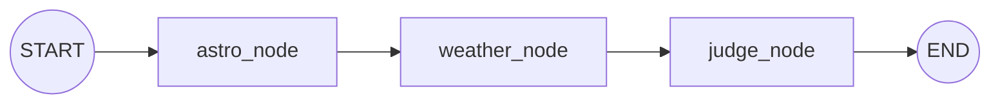

# 제주 밤하늘 관측 MCP — 데이터·LangGraph 구조 정리

> 현재 단계(P0 — "걷는 뼈대"): `astro → weather → judge` 를 LangGraph StateGraph 로
> 잇고, FastMCP 로 `evaluate_spot`·`evaluate_place` 두 도구를 노출한다.
> 어둡기(SQM)·별 개수 축은 아직 없고, 노드를 하나씩 붙여 확장할 수 있게 설계돼 있다.

---

## 1. 사용한 데이터

| 데이터 | 출처 | 파일 / 접근 | 지금 쓰는가 | 용도 |
|---|---|---|---|---|
| **천체력 (Ephemeris)** | JPL DE421 (via Skyfield) | `data/ephem/de421.bsp` (16 MB, 로컬 고정) | ✅ | 태양 고도 → 박명 구간·완전한 밤 구간 계산 |
| **기상 예보** | Open-Meteo API | `https://api.open-meteo.com/v1/forecast` (캐시 1h + 재시도) | ✅ | 정시별 **저층운·중층운·고층운(%)**, **시정(m)** 조회 |
| **지오코딩** | Photon (Komoot, OSM 기반) | `https://photon.komoot.io/api/` | ✅ | 주소·지명 → 좌표 (`evaluate_place`) |
| **다크스카이 관측지 큐레이션** | 한국관광공사·비짓제주·위키·디지털문화대전 교차확인 | `data/jeju_spots.json` (20곳) | ⚠️ 참고자료 | 제주 대표 관측지 20곳 좌표·정성 정보. **엔진엔 아직 미연결** |
| **광공해 래스터 (VIIRS)** | VIIRS/NPP 야간광 | `data/raw/jeju_2025_viirs_npp.tif`, `jeju_2025_GeoTIFF_raw.tif` | ❌ 미사용 | 향후 어둡기(SQM/Bortle) 실검증용 원본. 아직 파이프라인 없음 |

### 데이터별 세부

- **DE421 (`data/ephem/de421.bsp`)**
  - Skyfield `Loader` 가 모듈 파일 기준 절대경로에서 1회 로드 → cwd 무관, 중복 다운로드 없음.
  - `skyfield.almanac.dark_twilight_day` 로 태양 고도 구간(0~4)을 **가공 없이** 노출.
    - `0` 완전한 밤(< −18°) / `1` 천문박명 / `2` 항해박명 / `3` 시민박명 / `4` 낮.
  - 모듈: `data/script/astro.py` — `twilight_state()`, `next_dark_start()`, `dark_window()`.

- **Open-Meteo (`data/script/open_meteo.py`)**
  - judge 가 소비하는 값만 요청: `cloud_cover_low`, `cloud_cover_mid`, `cloud_cover_high`, `visibility` (기온·습도 등은 요청조차 안 함).
    - 저·중층운 → 차폐 축, 고층운 → 투명도 축, 시정 → 참고 문구용 (§2.4).
  - `when` 이 속한 정시로 내림해 그 시각의 예보값 사용. 값 없으면(NaN·범위 밖) `None`.
  - `requests_cache`(1h) + `retry_requests`(5회) 로 감싼 클라이언트를 모듈 로드 시 1회 초기화.
  - ⚠️ 요청 변수 순서 = 반환부 `Variables(index)` 순서. 어긋나면 값이 뒤섞이거나 인덱스 초과로 터진다.

- **Photon (`server/geocode.py`)**
  - 키 불필요·오픈소스. 제주 bbox 편향 + 접두 지역어("한라산 ", "제주시 " 등) 제거 변형 fallback.
  - `geocode(query) -> GeocodeResult | None` 시그니처만 지키면 교체 가능(호출부 불변).
  - 제주 범위 밖 결과는 버림. 못 찾으면 `None` → Host LLM 이 웹검색 등으로 폴백.

- **`data/jeju_spots.json`** (20곳, `meta` + `spots`)
  - 각 항목: `name_ko/en`, `lat`, `lon`, `coord_confidence`(high/medium/low), `region`, `type`, `why`, `notes`.
  - 좌표는 교차확인했으나 다수 오름·시설은 공표 십진좌표가 없어 주소 기반 추정 → 신뢰도 필드로 표기.
  - 개별 지점 SQM/Bortle 실측 공표값이 거의 없어 `notes` 는 **정성적** 광공해 정보.

---

## 2. LangGraph 구조

### 2.1 전체 흐름



- 파일: `server/engine/graph.py` (그래프 조립·노드), `server/engine/state.py` (공유 상태).
- 선형 파이프라인. 각 노드는 계획서의 provider/factor 역할이며, 자기 조각만 반환하고
  공유 상태에 **누적**한다. 축을 늘려도(어둡기·별 개수 …) 이 그래프 조립과 state 계약은 안 바뀐다.

### 2.2 공유 상태 `EngineState` (`state.py`)

`TypedDict(total=False)`. 값의 성격에 따라 병합 방식이 다름:

| 필드 | 종류 | 병합 규칙 | 의미 |
|---|---|---|---|
| `lat`, `lon`, `when` | 입력 ctx | — | 관측지 좌표·평가 시각(tz-aware KST) |
| `state_code` | 스칼라 | overwrite | 박명 구간 값(0=완전한 밤) |
| `cloud_low`, `cloud_mid`, `cloud_high` | 스칼라 | overwrite | 저·중·고층운(%) |
| `visibility` | 스칼라 | overwrite | 시정(m) |
| `verdict`, `possible` | 스칼라 | overwrite | 판정 등급·관측 가능 여부 |
| `numbers` | 누적 | `_merge`(얕은 dict 병합, 뒤가 이김) | LLM 이 지어내지 못하게 문장과 분리한 구조화 수치 |
| `reasons` | 누적 | `operator.add`(list 연결) | 사람이 읽는 근거 문자열 |
| `attribution` | 누적 | `operator.add`(list 연결) | 데이터 출처 |

> 리듀서로 "각 노드는 자기 조각만 반환 → 상태가 알아서 합쳐짐"을 표현. 스칼라는 마지막 기록이 이김.

### 2.3 노드별 책임 (관심사 분리)

| 노드 | 입력 | 출력(상태 조각) | 성격 |
|---|---|---|---|
| **astro_node** | `lat, lon, when` | `state_code`, `numbers.twilight_state`, `numbers.dark_window`, `attribution` | **천문학적 사실**만. 문장·판정 안 만듦 |
| **weather_node** | `lat, lon, when` | `cloud_low/mid/high`, `visibility`, `numbers.*`, `attribution` | 외부 I/O. **예외를 밖으로 안 냄** — 실패 시 값 `None` 으로 흘림 |
| **judge_node** | `state_code`, `cloud_low/mid/high`, `visibility` | `verdict`, `possible`, `reasons` | **운영 정책**. 순수 함수 `judge.judge()` 호출 |

핵심 설계 원칙:
- **astro 는 사실, judge 는 정책.** 항해박명(상태 2)에도 밝은 별은 보인다 — 이 판단은 astro 가 상태를 깎지 않고 그대로 넘기고 judge 가 결정.
- **weather 는 절대 예외를 던지지 않는다.** 타임아웃·429·예보 범위 밖이면 값을 `None` 으로 흘려보내 P0 의 "항상 고정 스키마 반환" 약속을 지킨다. judge 가 `None` 을 "데이터 없음 → 알 수 없음"으로 환원.

### 2.4 판정 정책 (`data/script/judge.py`, 순수 함수)

**세 축을 각각 평가한 뒤 가장 나쁜 축을 따른다**(`max(_RANK[...])`). 하나의 점수로
가중합하지 않는다 — 검증 불가능한 계수가 생기기 때문(ESO 의 AND 구조를 따름,
Kerber et al. 2014). 등급 순위: 최적(0) < 양호(1) < 밝은 별 한정(2) < 불가(3).
`알 수 없음`은 이 순위에 없는 **별개 상태**다.

**① 어둡기 축 — 태양 고도(등급 상한)**

| 상태 | 등급 | 설명 |
|---|---|---|
| 0 완전한 밤(< −18°) | **최적** | 은하수·성운까지 |
| 1 천문박명(−18~−12°) | **양호** | 대부분의 맨눈 별 |
| 2 항해박명(−12~−6°) | **밝은 별 한정** | 밝은 별·별자리 보이기 시작 |
| 3 시민박명(−6~0°) | **불가** | 아직 하늘이 밝음 |
| 4 낮 | **불가** | 해가 떠 있음 |

**② 차폐 축 — 저층운 + 중층운** (물방울 구름 = 불투명, 별을 물리적으로 가림)
- 두 층을 단순 합이 아니라 **random overlap** 으로 결합(같은 하늘 조각을 두 층이 겹쳐 덮을 수 있음, Geleyn & Hollingsworth 1979):
  `차폐율 = 1 − (1 − low) × (1 − mid)`
- 차폐율을 아래 **임계값 사다리**에 넣어 등급 산출.

**③ 투명도 축 — 고층운** (권운 = 얼음 결정, 반투과 → 가리지 않고 어둡게만)
- 같은 사다리를 적용하되, 권운 단독으로는 **'불가'가 될 수 없다** — 하한은 '밝은 별 한정'(ESO thin cirrus 분류).

**임계값 사다리 (차폐·투명도 축 공통, 전부 문헌값 — 튜닝 대상 아님)**

| 운량 | 등급 | 근거 |
|---|---|---|
| ≤ 10% | 최적 | ESO clear sky (Kerber et al. 2014) |
| ≤ 30% | 양호 | Xin et al. 2020 PTB 상한 |
| ≤ 50% | 밝은 별 한정 | Xin et al. 2020 STB 상한 |
| > 50% | 불가 | — |

**시정 — 판정에 관여하지 않음**: 참고 문구(안개 <1km / 연무 <10km / 맑음)만 바꾼다. 근거:
① 수평 vs 수직 물리량 차이, ② 저층운과 중복, ③ 예보 성능 낮음(ECMWF 자체 experimental 명시).

**결측** (구름 값 중 하나라도 `None`) → **'불가'가 아니라 '알 수 없음'**. 모르는 것과
나쁜 것을 같은 등급으로 두면 관측지 추천에서 데이터 없는 지점이 흐린 지점과 같은 순위로 떨어지기 때문.

> 근거 문헌: Patat 2006 A&A 455 / NOAA·USNO 박명 정의 / Crumey 2014 MNRAS 442 /
> Kerber et al. 2014 / Xin et al. 2020 / Geleyn & Hollingsworth 1979 /
> WMO 안개 정의(1 km). 상세는 `common/star_observation_conditions.md`.
> 판정 함수: `judge(state, cloud_low, cloud_mid, cloud_high, visibility_m)` — 파일 하단
> `__main__` 에 34개 케이스 + 불변식 5종(단조성·상한·overlap 등) 자체 검증 포함.

---

## 3. MCP 서버 계층 (`server/mcp_server.py`)

- **FastMCP · stateless · streamable HTTP `/mcp`**. 실행: `uv run python -m server.mcp_server` → `http://127.0.0.1:8000/mcp`.
- 응답 스키마(`server/schema.py`, `Response`): `verdict / reasons / numbers / attribution / as_of`.
  - 값이 부분/하드코딩이라도 응답 **모양은 1단계부터 최종형으로 고정**(필드 추가는 쉬워도 구조 변경은 어렵기 때문).

### 도구 2개

| 도구 | 입력 | 동작 |
|---|---|---|
| `evaluate_spot(lat, lon, date?, time?)` | 좌표 | 제주 범위 검사 → `graph.run()` → 스키마 응답 |
| `evaluate_place(query, date?, time?)` | 주소·지명 | `geocode(query)` → 좌표 변환 후 `evaluate_spot` 과 동일 코어 공유 |

가드레일:
- **제주 범위 밖**(위도 33.1908~33.5639, 경도 126.1452~126.9723) → "지원 범위 밖" 프롬프트형 응답.
- **날짜/시각 형식 오류** → "입력 오류" 프롬프트형 응답. (`date` 생략=오늘, `time` 생략=22:00, 둘 다 생략=현재)
- **지오코딩 실패** → "주소 확인 실패" + 좌표로 재시도 안내. 좌표 탐색은 Host LLM 몫(MCP 표준, 서버 간 결합 회피).
- 관측 가능하면 오늘 **완전히 어두운 시간대(dark_window)** 를 덤으로 안내.

### 요청 처리 흐름

```
evaluate_place(query)          evaluate_spot(lat,lon)
        │                              │
   geocode(Photon)                     │
        │  (lat,lon)                    │
        └──────────► _evaluate_coords ◄─┘
                          │
                    _in_jeju? / _resolve_when()
                          │
                     graph.run(lat,lon,when)   ← LangGraph
                          │
                astro → weather → judge  (state 누적)
                          │
              Response(verdict, reasons, numbers, attribution, as_of).to_dict()
```

---

## 4. 코드 배치 현황

```
server/
  mcp_server.py        # FastMCP 도구 2개 + 가드레일 (진입점)
  schema.py            # Response(최종형 응답 스키마)
  geocode.py           # Photon 지오코딩 provider
  engine/
    graph.py           # LangGraph 조립 + 3개 노드 + run()
    state.py           # EngineState(리듀서 정의)
data/
  ephem/de421.bsp      # JPL 천체력 (astro가 사용)
  jeju_spots.json      # 관측지 20곳 (아직 엔진 미연결)
  raw/*.tif            # VIIRS 광공해 래스터 (미사용, 향후 어둡기 축)
  script/
    astro.py           # 태양 고도 → 박명/완전한 밤 (사실)
    open_meteo.py      # 기상 조회 (저·중·고층운 + 시정)
    judge.py           # 관측 등급 판정 (3축 정책, 순수 함수)
```

> **임시 브리지:** 계산 3모듈(`data/script/{astro,judge,open_meteo}`)은 아직 PR 검토 중이라
> `graph.py` 가 `sys.path` 에 경로만 추가해 import 한다. 이후 `server/providers`·`server/factors` 로 정식 이관 예정
> (그때도 그래프 조립·state 계약은 불변, 노드만 늘어남).

---

## 5. 최근 반영 / 다음 확장 축

**최근 반영** — 구름 판정을 저층운 단일 차단에서 **3축(차폐·투명도·어둡기) 정책**으로 확장.
`open_meteo.fetch` 가 중·고층운을 추가 조회하고, `state`·`weather_node`·`judge` 가
이를 관통하도록 배선. 결측을 '불가'와 분리해 '알 수 없음' 등급 신설.

**다음 확장 축**
- **어둡기(SQM/Bortle)** — VIIRS 래스터(`data/raw/*.tif`)를 좌표 샘플링하는 provider 노드 추가 예정. `numbers` 에 필드만 늘리면 됨.
- **별 개수 / 특정 천체(달·행성·은하수) 가시성** — 별도 노드로 파이프라인에 append.
- **`jeju_spots.json` 연동** — 큐레이션 관측지 추천/랭킹 도구(현재는 좌표·정성 정보만 보유).