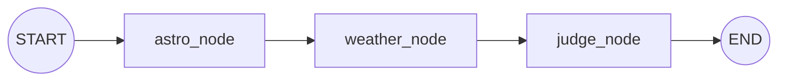

# 제주 밤하늘 관측 MCP — 데이터·아키텍처 정리

> 현재 단계(P0 — "걷는 뼈대"): 두 질의 형태를 지원한다.
> **"지금 별 보이나?"**(한 시각, `astro→weather→judge` 그래프)와
> **"오늘 밤 볼 수 있나?"**(밤 전체를 시간별로 판정해 모으는 집계).
> 어둡기(SQM)·별 개수 축은 아직 없고, 노드·축을 하나씩 붙여 확장할 수 있게 설계돼 있다.
>
> 이 문서는 **어떤 데이터를 / 어떻게 쓰고 / 왜 그렇게 판정하는가**를 정리한다.
> 판정 임계값은 전부 문헌값이며, 근거 문헌은 각 절 끝과 `common/star_*` 에 있다.

---

## 0. 한눈에 보기

```
사용자 질의
        │
        ▼
 ┌──────────────────────── MCP 서버 (FastMCP) ────────────────────────┐
 │  "지금?"     evaluate_spot(좌표) / evaluate_place(지명)             │
 │  "오늘 밤?"  evaluate_night_spot(좌표) / evaluate_night_place(지명) │
 │        └──(place 는 geocode 로 좌표화)── 제주 범위·시각 가드 ──┐   │
 └──────────────────────────────────────────────────────────────┼───┘
                                                                  ▼
       ┌──────────────────── 엔진 (server/engine) ────────────────────┐
       │  run()         : astro ─▶ weather ─▶ judge   (한 시각)        │
       │  run_tonight() : 밤 구간의 매 정시마다 judge ─▶ tonight 집계  │
       └───────────────────────────────────────────────────────────────┘
                        │            │             │
                 DE421(로컬)     Open-Meteo    (순수 함수·정책)
                 태양 고도       총운량·시정
```

- **astro** = 천문학적 *사실*(태양이 얼마나 내려갔나)
- **weather** = 외부 *예보*(총운량·시정)
- **judge** = *정책*(그 사실·예보를 한 시각 등급으로 환산) — **순간 판정**
- **tonight** = judge 를 밤 전체로 *집계*(관측 가능 시간 수·분포) — **밤 단위**

이 관심사들을 절대 섞지 않는 것이 설계의 뼈대다. astro 는 등급을 만들지 않고,
weather 는 예외를 밖으로 던지지 않으며, judge 는 API 를 호출하지 않고, tonight 은
"충분한가"를 판정하지 않는다(시간 수만 돌려준다).

---

## 1. 사용한 데이터

| 데이터 | 출처 | 파일 / 접근 | 지금 쓰는가 | 용도 |
|---|---|---|---|---|
| **천체력 (Ephemeris)** | JPL DE421 (via Skyfield) | `data/ephem/de421.bsp` (로컬 고정) | ✅ | 태양 고도 → 박명 구간·완전한 밤/박명 포함 밤 구간 |
| **기상 예보** | Open-Meteo Forecast API | `api.open-meteo.com/v1/forecast` (캐시 1h + 재시도 5회) | ✅ | 정시별 **총운량(%)**·**시정(m)**. 한 시각(`fetch`) 또는 밤 구간 시계열(`fetch_series`) |
| **지오코딩** | Photon (Komoot, OSM 기반) | `photon.komoot.io/api/` (키 불필요) | ✅ | 주소·지명 → 좌표 (`evaluate_place`·`evaluate_night_place`) |
| **다크스카이 관측지 큐레이션** | 관광공사·비짓제주·위키·문화대전 교차확인 | `data/jeju_spots.json` (20곳) | ⚠️ 참고자료 | 제주 대표 관측지 20곳 좌표·정성 정보. **엔진엔 아직 미연결** |
| **광공해 래스터 (VIIRS)** | VIIRS/NPP 야간광 | `data/raw/*.tif` | ❌ 미사용 | 향후 어둡기(SQM/Bortle) 실검증용 원본. 파이프라인 아직 없음 |

> **이전 버전과의 차이**: 표고 기반 운해 보정을 위해 쓰던 Open-Meteo **Elevation API**와
> **기압면 운량**은 제거했다(§2.5). 구름은 이제 집계 총운량 한 값으로만 평가한다.

### 데이터별 세부 — *무엇이고 어떻게 쓰는가*

- **DE421 천체력 (`data/ephem/de421.bsp` → `data/script/astro.py`)**
  - JPL 이 배포하는 행성력. Skyfield `Loader` 가 **모듈 파일 기준 절대경로**에서 1회 로드하므로
    실행 위치(cwd)와 무관하고 중복 다운로드가 없다.
  - `skyfield.almanac.dark_twilight_day` 로 태양 고도 구간(0~4)을 **가공 없이** 노출한다.
    `0` 완전한 밤(< −18°) / `1` 천문박명 / `2` 항해박명 / `3` 시민박명 / `4` 낮.
  - 함수: `twilight_state()`(한 시각 상태), `dark_window()`(완전한 밤=상태 0),
    `night_window()`(**박명 포함 밤=상태 0/1/2, 태양 < −6°** — 밤 집계의 시간 창).
  - **왜 로컬 파일인가**: 태양 고도는 좌표·시각만으로 결정되는 결정론적 천문값이라 외부 호출이
    필요 없다. 로컬 천체력이면 오프라인·무지연·재현 가능하다.

- **Open-Meteo Forecast (`data/script/open_meteo.py`)**
  - judge 가 실제로 소비하는 값만 요청한다 — `cloud_cover`(총운량, %)·`visibility`(시정, m).
    기온·습도 등은 판정에 안 쓰므로 **요청조차 하지 않는다**.
  - 두 형태: `fetch(when)`(한 정시) / `fetch_series(start, end)`(밤 구간 각 정시를 **한 번의
    호출로** 수신). 밤 집계는 후자로 밤 전체를 1회에 받는다.
  - `when`·구간은 **정시로 내림**해 그 시각의 예보값을 쓴다. 값이 없으면(NaN·범위 밖) `None`.
  - `requests_cache`(1h) + `retry_requests`(5회, 지수 백오프) 로 감싼 클라이언트를 모듈 로드 시 1회 초기화.
  - **왜 층별이 아니라 총운량 한 값인가**: 관측자가 실제로 마주하는 것은 머리 위를 덮은 구름의
    **총량**이다. 층을 나눠 가중합하면 검증 불가능한 계수가 생긴다.

- **Photon 지오코딩 (`server/geocode.py`)**
  - 키 불필요·오픈소스. Nominatim 대비 퍼지 매칭이 강해 "1100고지" 같은 비정형 지명을 잘 잡는다.
  - 제주 bbox 편향 + **알려진 접두 지역어**("한라산 ", "제주시 " 등) 제거 변형 fallback.
    끝/첫 토큰을 임의로 떼는 축약은 '성산일출봉 없는장소'→'성산일출봉'처럼 존재하지 않는 질의를
    엉뚱한 실제 장소로 확정시키므로 **쓰지 않는다**. 단독 지역어("제주" 등)로 축약된 후보도 제외.
  - 제주 범위 밖 결과는 버림. 못 찾으면 `None` → Host LLM 이 웹검색 등으로 좌표를 구해
    `evaluate_spot(lat, lon)` 을 호출하는 오케스트레이션에 맡긴다(MCP 표준, 서버 간 결합 회피).

- **`data/jeju_spots.json`** (20곳) — 좌표·정성 광공해 정보(신뢰도 필드 포함). **엔진 미연결(참고자료)**.

---

## 2. 판정 로직 — *왜 그렇게 평가하는가*

판정은 두 층으로 나뉜다. **아래층(judge)은 한 시각을 판정**하고, **위층(tonight)은 그
판정들을 밤 단위로 집계**한다. 둘 다 순수 함수라 API 없이 값만 받아 값만 반환하며,
파일 하단 `__main__` 에 케이스·불변식 자체 검증을 둔다. **임계값 30/50 은 두 층이 공유**한다.

```
judge(state, cloud_cover, visibility)   ← 한 시각. "지금 별 보이나?"
        ↑ 밤 구간의 매 정시마다 반복 호출
tonight.summarize(시간별 판정 목록)      ← 밤 전체. "오늘 밤 볼 수 있나?"
```

### 2.1 judge — 두 축을 각각 평가하고 나쁜 쪽을 따른다

```
어둡기 축 (태양 고도)  →  등급
차폐 축   (총운량)     →  등급        →  max(나쁜 쪽)  →  최종 등급
시정                   →  판정에 관여 안 함(참고 문구만)
```

두 축을 하나의 점수로 **가중합하지 않는다**. ESO 가 clear sky 를 "운량 10% 미만 **AND**
투과율 변동 10% 미만" 으로 두 조건을 각각 거는 구조를 따른 것이다. 가중합으로 단일 점수를
만들면 검증할 수 없는 계수가 생기므로 쓰지 않는다. (Kerber et al. 2014)

등급 순위: **최적(0) < 양호(1) < 밝은 별 한정(2) < 불가(3)**. `알 수 없음`은 이 순위에
없는 **별개 상태**다(§2.4).

### 2.2 어둡기 축 — 태양 고도 (등급 상한)

| 상태 (`twilight_state`) | 등급 | 설명 |
|---|---|---|
| 0 완전한 밤 (< −18°) | **최적** | 은하수·성운까지 |
| 1 천문박명 (−18~−12°) | **양호** | 대부분의 맨눈 별 |
| 2 항해박명 (−12~−6°) | **밝은 별 한정** | 밝은 별·별자리 보이기 시작 |
| 3 시민박명 (−6~0°) | **불가** | 아직 하늘이 밝음 |
| 4 낮 | **불가** | 해가 떠 있음 |

> 근거: Patat 2006 A&A 455 / NOAA·USNO 박명 정의 / Crumey 2014 MNRAS 442.
> 상태 3·4 는 애초에 별을 볼 시간대가 아니므로 날씨를 보기 전에 곧바로 '불가'로 단락한다.

### 2.3 차폐 축 — 총운량 (임계값 사다리)

구름은 하늘이 아무리 어두워도 별을 **물리적으로** 가리므로 어둡기 등급과 무관하게 등급을
끌어내린다. 층 구분 없이 총운량 한 값으로 판정한다.

| 총운량 | 등급 | 근거 |
|---|---|---|
| ≤ 10% | 최적 | ESO clear sky (Kerber et al. 2014) |
| ≤ 30% | 양호 | Xin et al. 2020 PTB 상한 — Ehgamberdiev et al. 2000 의 clear night 25% 가 이 구간 |
| ≤ 50% | 밝은 별 한정 | Xin et al. 2020 STB 상한 |
| > 50% | 불가 | — |

- 경계는 절벽이 아니라 **단계적**이다. 부동소수점 오차로 경계값이 한 단계 아래로 떨어지지
  않게 비교에 `_EPS`(1e-9)를 둔다.

### 2.4 시정·결측

- **시정은 판정에 관여하지 않는다**(참고 문구만: 안개 <1km / 연무 <10km / 맑음). 이유 셋:
  ① 예보 시정은 *수평* 시정인데 별은 *수직*으로 봄, ② 하늘을 가릴 두꺼운 안개는 이미
  총운량에 반영됨, ③ ECMWF 가 자사 시정을 "experimental … expectations … should remain
  low" 로 명시(1100고지는 동일 시각 시정이 모델에 따라 140 m ~ 24 km). 안개 1 km 는 WMO 정의.
- **결측 → '불가'가 아니라 '알 수 없음'**. 등급을 정하는 건 차폐 축(총운량)이므로 총운량이
  없으면 모름이다. 모르는 것과 나쁜 것을 같은 등급으로 두면 관측지 추천에서 데이터 없는
  지점이 흐린 지점과 같은 순위로 떨어진다.

### 2.5 tonight — 밤 단위 집계 (`data/script/tonight.py`)

judge 는 한 시점을 답한다. 그 위에 한 층을 얹어 **밤 전체**를 답한다. 밤 구간
(`astro.night_window`, 박명 포함=태양 < −6°)의 매 정시를 judge 로 판정한 목록을 받아
집계한다.

**핵심 — 판정하지 않고 시간 수를 그대로 준다.**
Xin et al. 2020 은 하룻밤을 사후 평가하는 통계 기준으로, 운량 ≤30% 지속 구간을
photometric time block(PTB), ≤50% 를 spectroscopic time block(STB)으로 정의하고 그 합이
**3시간**을 넘으면 '관측 가능한 밤'으로 본다. 그러나 이 3시간은 천문대가 밤새 관측 프로그램을
돌리는 것을 전제한 기준이다. **맨눈 관측(관광)은 1~2시간이면 충분**하므로, 3시간 미만을
'불가'로 잘라내면 실제로 별을 볼 수 있는 밤을 상당수 걸러낸다.

그래서 tonight 은 3시간 기준으로 가능/불가를 **매기지 않는다**. 관측 가능한 시간 수·등급별
분포·연속 관측 창을 그대로 반환하고, "충분한가"는 호출자(LLM·사용자)가 정한다 — 근거 수치를
함께 돌려주어 호출자가 판정을 재구성하게 하는, 이 프로젝트의 일관된 방식이다.

- `summarize()` 반환: `observable_hours`(관측 가능 정시 수), `by_grade`(judge 등급 분포),
  `photometric_hours`/`spectroscopic_hours`(운량 ≤30/≤50 정시 수 = PTB/STB, 순수 운량 기준),
  `windows`(연속 관측 창 목록), `unknown_hours`(데이터 없는 정시 수).
- `by_grade`(judge 판정, 어둡기 축 포함)와 `photometric/spectroscopic_hours`(순수 운량)는
  서로 다른 정보라 둘 다 노출한다. **PTB ⊂ STB**(≤30 은 ≤50 의 부분집합).
- **원 정의의 '10분 중단 허용'은 적용하지 않는다** — Open-Meteo 는 시간당 값 하나를 주므로 한
  시간 안의 10분 변동을 알 수 없다. 각 정시가 임계값을 넘느냐로만 센다.
- **왜 박명 포함 밤(< −6°)을 창으로 쓰나**: 여름처럼 완전한 밤이 짧은 철에도 이른 저녁 박명의
  밝은 별 관측 시간을 창에 포함하기 위해서다. 창 안 각 정시의 등급은 judge 가 어둡기 상태
  (0/1/2)에 맞춰 상한을 두므로, 박명 시간대는 자연히 '양호'·'밝은 별 한정'으로 표시된다.

---

## 3. 엔진 (`server/engine`)

### 3.1 순간 판정 그래프 `run()`



- 파일: `graph.py`(그래프 조립·노드), `state.py`(공유 상태). LangGraph `StateGraph`.
- 각 노드는 자기 조각만 반환하고 공유 상태에 **누적**한다(리듀서). 축을 늘려도 그래프 조립과
  state 계약은 안 바뀐다 — 노드·엣지만 늘어난다.
- 계산 3+1모듈(`data/script/{astro,judge,open_meteo,tonight}`)은 아직 옮기지 않고 `sys.path`
  브리지로 import 만 한다. P1/P2 에서 `server/providers`·`factors` 로 정식 이관 예정.

| 노드 | 출력(상태 조각) | 성격 |
|---|---|---|
| **astro_node** | `state_code`, `numbers.twilight_state`, `numbers.dark_window` | **천문학적 사실**만 |
| **weather_node** | `cloud`, `visibility`, `numbers.cloud_cover`·`visibility_m` | 외부 I/O. **예외를 밖으로 안 냄** — 실패 시 값 `None` |
| **judge_node** | `verdict`, `possible`, `reasons` | **운영 정책**. 순수 함수 `judge.judge()` 호출 |

`EngineState`(`state.py`, `TypedDict`): 스칼라(`state_code`·`cloud`·`visibility`·`verdict`·
`possible`)는 overwrite, 누적 필드(`numbers`·`reasons`·`attribution`)는 리듀서(dict 얕은
병합 / list 연결)로 합친다.

### 3.2 밤 집계 `run_tonight()`

LangGraph 그래프가 아니라 계산 모듈을 조립하는 함수다.

1. `astro.night_window()` 로 밤 구간(박명 포함)을 구한다. 없으면(백야 등) `summary=None`.
2. `open_meteo.fetch_series()` 로 그 구간의 시간별 총운량·시정을 **한 번에** 받는다.
   외부 I/O 실패는 `run` 의 weather_node 와 같은 규율로 여기서 잡아 `summary=None` 으로 흘린다.
3. 매 정시마다 `astro.twilight_state()` + `judge.judge()` → 정시별 판정.
4. `tonight.summarize()` 로 모아 `window`·`summary`·`attribution` 반환.

---

## 4. MCP 서버 계층 (`server/mcp_server.py`)

- **FastMCP · stateless · streamable HTTP `/mcp`**. 실행: `uv run python -m server.mcp_server`
  → `http://127.0.0.1:8000/mcp`.
- 응답 스키마(`server/schema.py`, `Response`): `verdict / reasons / numbers / attribution /
  as_of / resolved`. 값이 부분/하드코딩이라도 응답 **모양은 최종형으로 고정**한다.
  - `numbers` 는 구조화 수치를 문장과 분리 — **LLM 이 숫자를 지어내지 못하게**.
  - `attribution`(출처)은 최상위에 두고 축약·생략하지 않는다.
  - `resolved`(지오코딩 해석 위치)는 place 성공 시에만 값이 차지만 **키는 모든 응답에 항상 존재**.

### 도구 4개 — 두 질의 × (좌표·지명)

| 도구 | 입력 | 질의 | 동작 |
|---|---|---|---|
| `evaluate_spot(lat, lon, date?, time?)` | 좌표 | 지금? | 범위 검사 → `graph.run()` → 한 시각 등급 |
| `evaluate_place(query, date?, time?)` | 지명 | 지금? | `geocode` → 좌표 후 위와 동일 코어 공유 |
| `evaluate_night_spot(lat, lon, date?)` | 좌표 | 오늘 밤? | 범위 검사 → `graph.run_tonight()` → 시간 수·분포 |
| `evaluate_night_place(query, date?)` | 지명 | 오늘 밤? | `geocode` → 좌표 후 밤 집계 코어 공유 |

- 밤 도구는 `time` 을 받지 않는다(밤 전체 집계). `verdict` 는 "오늘 밤 약 N시간 관측 가능"
  같은 **사실 서술**이며 3시간 기준의 가능/불가가 아니다(0시간도 '불가'가 아니라 사실 서술).

### 가드레일

- **제주 범위 밖**(위도 33.1908~33.5639, 경도 126.1452~126.9723) → "지원 범위 밖" 프롬프트형 응답.
- **날짜/시각 형식 오류** → "입력 오류" 프롬프트형 응답. (순간: `date` 생략=오늘·`time` 생략=22:00·
  둘 다 생략=현재 / 밤: `date` 생략=오늘 밤)
- **지오코딩 실패** → "주소 확인 실패" + 좌표로 재시도 안내. 좌표 탐색은 Host LLM 몫(MCP 표준).
- 순간 평가가 관측 가능하면 오늘 **완전히 어두운 시간대(`dark_window`)** 를 덤으로 안내.

---

## 5. 근거 문헌 (요약)

- 박명 단계·별 가시성: Patat 2006 A&A 455 / Crumey 2014 MNRAS 442 / NOAA·USNO 박명 정의
- 두 축 AND 구조·clear sky 10%: Kerber et al. 2014
- 운량 30/50% 사다리·PTB/STB·밤 3시간 기준: Xin et al. 2020 / Ehgamberdiev et al. 2000(25%)
- 시정 예보 신뢰도: ECMWF Forecast User Guide (Visibility) / 안개 1 km: WMO 정의

> 상세 조사·검증 노트: `common/star_research.md`, `common/star_observation_conditions.md`,
> `common/star_research_validation*.md`.
</content>
