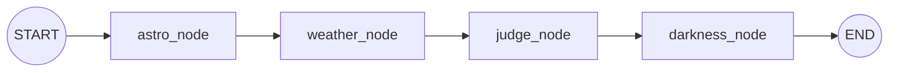

# 제주 밤하늘 관측 MCP — 데이터·아키텍처 정리

> 이 서버가 최종적으로 해결하는 질문은 "오늘 밤(또는 지금), 현재 위치 혹은 지정한 위치 근처 무리 없이 다녀올 수 있는 거리 안에서 별을 보기 가장 좋은 곳은 어디인가?"이다.

> 사용자는 제주를 여행 중인 "관광객"을 가정한다. 사용자의 현재 위치는 제공될 수도 있고 제공되지 않을 수도 있으며, 일반적으로 왕복 1시간 이내의 이동을 선호한다. 또한 초행 운전자일 가능성이 높고, 야간 운전이라는 상황​을 고려해야 한다.

> 따라서 이 서버는 단순히 어두운 장소를 찾는 것이 아니라, 실제로 방문 가능한 별 관측 장소를 추천하는 것을 목표로 한다. 이를 위해 별 관측 환경뿐만 아니라 접근성, 주차 가능 여부, 출입 가능 여부, 운전 난이도 등 관광객의 실제 의사결정에 필요한 정보를 함께 제공한다.


---

## 0. 한눈에 보기

서두의 질문에 답하려면 **세 개의 층**이 필요하다.

```
 "오늘 밤(또는 지금), 이 근처에서 별 보기 가장 좋은 곳은?"
    │
    ├─ [후보 층]  갈 만한 곳이 애초에 어디 있나              ⏳ P9
    │      자동 발굴(어둡기 ∩ 토지소유 ∩ 주차 ∩ 도로 접근)
    │      → 로드뷰 데스크 전수 검증 → 후보 풀 200곳
    │
    ├─ [판정 층]  그 곳이 오늘 밤(또는 지금) 어떤가          ✅ 구현됨
    │      astro(박명) · weather(구름) · darkness(광공해)
    │      → judge(한 시각 등급) → tonight(밤 단위 집계)
    │
    └─ [정렬·보강 층]  무엇부터 보여주고, 실제로 갈 수 있나  ⏳ P10~P13
           랭커(순서) · 접근성(주행시간·주차) · 안전(위험·안개) · 지도
```

**지금 있는 것은 판정 층 하나다.** 후보 층이 없어 추천할 후보가 없고, 정렬·보강 층이 없어
순서를 정하거나 "무리 없이 다녀올 수 있는가"를 답하지 못한다. 그래서 현재 서버가 답하는
범위는 **"이 좌표가 오늘 밤 어떤가"** 까지다 — 질문의 아래층이다.

층을 이렇게 나눈 이유는 **판정 층이 나머지 둘과 독립이기 때문**이다. 판정 엔진은 후보가
20곳이든 200곳이든 같고, 순서를 어떻게 매기든 등급은 바뀌지 않는다. 그래서 판정 층을 먼저
검증하고 나머지를 얹는다 (`plan.md` §6).

**"단순히 어두운 장소를 찾는 게 아니다"가 구조에 남긴 것**이 정렬·보강 층이다. 어둡기만으로
고르면 사유지 농로·묘지·갓길 없는 절개지가 1등으로 나온다. 관광객이 초행길에 밤에 가므로
이건 관측 실패가 아니라 **안전 문제**다. 그래서 접근성·출입 가능 여부·운전 난이도는 결과에
덧붙는 부가정보가 아니라 **후보를 거르고 정렬하는 축**으로 들어간다.

**위치가 없을 수도 있다는 전제**도 구조에 남는다. 다만 *출발지가 있나*와 *목적지를
지정했나*는 **직교하는 축**이라 한 줄로 접히지 않는다 — 네 경우를 각각 답해야 한다.

| | **출발지 없음** | **출발지 있음** |
|---|---|---|
| **목적지 미지정** | 제주 전역 top N. 거리 축만 빠지고 나머지는 그대로 | 주행시간으로 반경을 자르고 **거리를 순위에 반영** |
| **목적지 지정** | 그 장소 하나를 평가 + 일반 주의사항 | 그 장소 평가 + **출발지→목적지 경로의 주의사항** (주행시간 · 경로 안개 · 급커브 · 조명 없는 구간) |

즉 **출발지가 있으면 목적지를 지정했든 아니든 경로를 함께 답한다.** "가는 동안 무엇을
조심해야 하나"는 추천에만 붙는 정보가 아니라 **출발지가 알려진 모든 경우에 붙는다** —
초행·야간 운전이라는 전제(서두)에서 나오는 것이지 질의 형태에서 나오는 게 아니기 때문이다.

거리·경로 축이 빠져도 응답은 같은 고정 스키마다 — 빠지는 것은 값 하나뿐이라는, 예보 지평
밖에서 구름만 미상으로 남는 것(§0.1)과 같은 규율이다.

> 이 문서는 **어떤 데이터를 / 어떻게 쓰고 / 왜 그렇게 판정하는가**를 정리한다. 아직 구현되지
> 않은 축은 **⏳ 계획**으로 표시해 구현된 것과 구분한다. 판정 임계값은 전부 문헌값이며,
> 근거 문헌은 각 절 끝과 `common/star_*` 에 있다.

### 0.1 판정 층 — 지금 구현된 것

판정 층 안에서 질의는 **세 축**을 가진다

① *입력 방식*(좌표 vs 지명) 
② *무엇을 묻나*(한 시각 vs 밤 전체)
③ *언제*(지금 vs 미래). 

이 중 **도구를 가르는 건 ①뿐**이다(지명은 geocode 단계가 추가됨).
②는 `scope` 파라미터, ③은 `date`·`time` 파라미터로 접는다 — 세 축을 곱해 도구를 8개로 쪼개는
대신, 도구 2개에 파라미터로 표현한다(지오코딩 래핑 중복 제거).

> **추천 도구가 붙으면 도구가 늘어난다** (`plan.md` §5). 위 원칙은 그대로다 — 가르는 기준이
> 여전히 "직교하는 축은 파라미터로"이고, 새로 가르는 것들(`find_spots` ·
> `find_spots_on_route`)은 **입력·출력의 모양 자체가 달라** 파라미터로 접히지 않는다.
> 경위는 `decisions.md` §2.5.

```
 ┌──────────────────── MCP 도구 (입력 방식으로만 2개) ────────────────────┐
 │  evaluate_spot (좌표,  date?, time?, scope="moment"|"night")          │
 │  evaluate_place(지명,  date?, time?, scope="moment"|"night")          │
 │       └ place 는 geocode 로 좌표화 → 동일 코어 공유                    │
 │                                                                        │
 │   scope="moment" → 한 시각      ·  scope="night" → 밤 전체 집계        │
 │   date·time      → 지금(생략) 또는 미래("내일 밤 23:00")              │
 └────────────────────────────────────────────────────────────────────────┘
        │ 제주 범위·날짜/시각·scope 형식 가드
        ▼
 ┌──────────────────── 엔진 (server/engine) ────────────────────┐
 │  scope=moment → run()         : astro ─▶ weather ─▶ judge ─▶ darkness │
 │  scope=night  → run_tonight() : 밤 구간의 매 정시 judge ─▶ tonight 집계│
 └───────────────────────────────────────────────────────────────┘
        │          │            │              │
   DE421(로컬)  Open-Meteo   (순수 정책)   SB 래스터(로컬)
   태양 고도    총운량·시정                광공해 SQM·Falchi
   ≈1900~2053   예보 ~7일     —            지평 없음(정적)
```

- **astro** = 천문학적 *사실*(태양이 얼마나 내려갔나) — 천체력 범위 안이면 **어떤 미래든** 계산
- **weather** = 외부 *예보*(총운량·시정) — **예보 지평(~7일) 안에서만** 값, 밖이면 '알 수 없음'
- **judge** = *정책*(그 사실·예보를 한 시각 등급으로 환산) — **순간 판정**
- **darkness** = 장소의 *고정 속성*(광공해 SQM·Falchi) — 정적, **날짜·시각과 무관**
- **tonight** = judge 를 밤 전체로 *집계*(관측 가능 시간 수·분포) — **밤 단위**

**미래는 어떤 구조로 가나.** "내일 밤 11시" 같은 질의는 새 경로가 아니라 같은 `run`/
`run_tonight` 에 미래 `when` 을 넘기는 것이다. 세 축의 시간 의존성이 다르기 때문에 지평 너머로
갈수록 답의 *구성*이 바뀐다:

| 축 | 시간 성격 | 미래 지평 |
|---|---|---|
| astro(박명) | 천문학적 사실 | **천체력 범위**(DE421 ≈1900~2053) 안이면 정확 |
| darkness(광공해) | 정적 장소 속성 | **없음** — 연 1회 래스터, 날짜 무관 |
| weather(구름·시정) | 예보 | Open-Meteo 시간별 **~7일**. 밖이면 구름만 `None`→'알 수 없음' |

→ 그래서 **예보 지평 안**이면 세 축이 다 차 완전한 답이 되고, **지평 밖**이면 "언제 어두운가
(박명)·얼마나 어두운 곳인가(광공해)"는 그대로 답하되 구름만 미상으로 남는다 — 응답은 항상 같은
고정 스키마이고, 빠지는 것은 값 하나뿐이다(§1 Open-Meteo '미래 계획 지평').

이 관심사들을 절대 섞지 않는 것이 설계의 뼈대다. astro 는 등급을 만들지 않고,
weather 는 예외를 밖으로 던지지 않으며, judge 는 API·장소를 모르고, darkness 는 verdict
등급을 바꾸지 않으며(문구만 정정), tonight 은 "충분한가"를 판정하지 않는다(시간 수만).

### 0.2 정렬·보강 층 — 판정과 정렬은 다른 층이다 (⏳ 계획)

추천(`find_spots`)이 붙으면 **후보를 무엇부터 보여줄지**를 정해야 한다. 이건 등급을 만드는
일과 다른 문제이므로 층을 나눈다.

| | 하는 일 | 입력 | 방식 |
|---|---|---|---|
| **judge** (구현됨) | **등급 산출** | 구름 · 박명 · 어둡기 상한 | 문헌 게이트 + `max()`. 가중합 없음 |
| **랭커** (⏳ 계획) | **같은 등급 안의 순서** | 어둡기 점수 · 구름 · 주행시간 · 고정 위험 | 정렬 키 |

`judge` 는 손대지 않는다. "가중합하지 않는다"(§2.1)는 **등급을 만드는 방식**에 대한 규율이고,
이미 등급이 정해진 후보들을 어떤 순서로 보여줄지는 그 규율이 다루는 문제가 아니다. 검증
불가능한 계수가 등급에 스며들 여지도 없다. 경위는 `decisions.md` §2.13.

**구름을 순위에 넣는 이유**: 제주는 동쪽이 맑고 서쪽이 흐린 일이 흔하다. 구름을 순위에서
빼면 **지금 구름 밑인 곳을 1등으로 추천**하게 된다.

**'불가'의 위치도 달라진다.** 장소별로 붙이지 않고 **밤 전체 헤드라인**으로 올린다 — 그것도
*현재 흐림 **AND** 예보도 지속*일 때만이다. 관광객은 이미 창밖으로 구름을 볼 수 있으므로,
지금 흐리다는 사실보다 **"이따 갤 것인가"** 가 실제로 필요한 정보다. 그 경우에도 후보 목록은
그대로 낸다 — 물어본 것이 "어디로 갈까"이기 때문이다.

이 층의 나머지(접근성·안전·지도)가 무엇을 어떻게 보는지는 **§2.7** 에 있다.

---

## 1. 사용한 데이터

| 데이터 | 출처 | 파일 / 접근 | 지금 쓰는가 | 용도 |
|---|---|---|---|---|
| **천체력 (Ephemeris)** | JPL DE421 (via Skyfield) | `data/ephem/de421.bsp` (로컬 고정) | ✅ | 태양 고도 → 박명 구간·완전한 밤/박명 포함 밤 구간 |
| **기상 예보** | Open-Meteo Forecast API | `api.open-meteo.com/v1/forecast` (캐시 1h + 재시도 5회) | ✅ | 정시별 **총운량(%)**·**시정(m)**. 한 시각(`fetch`) 또는 밤 구간 시계열(`fetch_series`) |
| **지오코딩** | Photon (Komoot, OSM 기반) | `photon.komoot.io/api/` (키 불필요) | ✅ | 주소·지명 → 좌표 (`evaluate_place`) |
| **광공해 — Sky Brightness** | NASA Black Marble(VNP46A4/VJ146A4) 기반, lightpollutionmap.info 산출(sb_2025). 귀속: "Jurij Stare, www.lightpollutionmap.info" + "NASA's Black Marble nighttime lights product" | `data/light_pollution/jeju_2025_GeoTIFF_raw.tif` → 전처리 `data/darkness/jeju_sb_grid.npz` | ✅ | 어둡기 축의 **광역 하늘밝기** 성분(주 기준) — 인공 밝기(mcd/m²) → **SQM·Falchi 등급** |
| **다크스카이 관측지 큐레이션** | 관광공사·비짓제주·위키·문화대전 교차확인(63곳) + 카카오맵 전수 수집 자동 발굴(131곳 — 장소 48 · 중산간 주차장 83) | `data/jeju_spots.json` (194곳) | ⚠️ 참고자료 | 좌표·정성 정보. **엔진엔 아직 미연결** — 자동 발굴분은 `discovery` 키로 구분하며 **사람이 아직 보지 않았다**. 후보 풀(P9) **200곳** 목표로 확장 후 연결 |
| **야간광 (VIIRS)** | NASA Black Marble VNP46A4 (CC0) | `data/light_pollution/jeju_2025_viirs_npp.tif` → 전처리 `jeju_viirs_grid.npz` | ✅ | 어둡기 축의 **국지 지상광** 성분 — 반경 1·3km 최대 복사휘도. 픽셀 절댓값은 판정에 쓰지 않는다(유효 픽셀 71.9%가 0) |
| **가로등·보안등** | 공공데이터포털 제주시(52,019) · 서귀포시(38,022). **이용허락범위 제한 없음** | `data/streetlight/*.csv` (import 시 직접 로드) | ✅ | 어둡기 축의 **발밑 광원** 성분 — 최근접 거리·반경 100m/500m/1km 개수. 제주시 파일의 위경도 뒤바뀜 15,514행을 교정해 쓴다(`decisions.md` §1.8) |
| **지형 고도 — 관측지 한 점** | Open-Meteo Elevation API — Copernicus DEM GLO-90 (90m) | `api.open-meteo.com/v1/elevation` (배치 전용, 키 불필요) | ✅ 배치 | `scripts/fetch_elevation.py` 가 관측지의 **해발높이·주변 90m 격자 경사**를 채운다. 격자가 90m 라 좁은 봉우리는 공표 표고보다 30~75m 낮게 나온다 — 그래도 맞는 값이다. 묻는 것이 정상 높이가 아니라 **차를 세우고 설 그 자리의 지형**이기 때문이다 |
| **지형 고도 — 도보 경로** | **FABDEM V1-2** — Copernicus GLO-30 에서 나무·건물을 걷어낸 **맨땅(DTM)**, 1초각 ~30m. Hawker et al. 2022 · Univ. of Bristol / Fathom · **CC BY-NC-SA 4.0** | 타일 1장 → `data/elevation/jeju_dem_grid.npz` (3.5MB). **커밋하지 않는다** — 라이선스상 재배포 불가라 `data/elevation/` 전체가 gitignore 다. `scripts/build_elevation_grid.py` 를 한 번 돌려 만든다 | ✅ | `server/core/elevation.py` 가 읽어 도보 경로·구간의 **고도차·경사**를 낸다. 네트워크 없음. DSM(GLO-30·SRTM)을 쓰면 제주 육지 67%가 1m 이상 부풀어 숲길 오름이 실제보다 가팔라진다 — `decisions.md` §2.17 |
| **탐방로 등급 기준** | 국립공원공단 「탐방로 등급제 정보」(2018-10-01, 공공데이터) | PDF → `server/core/trail.py` 에 표로 옮김 | ✅ | 도보 경로의 **힘든 정도**. 경사도·거리·암릉암반·노면상태를 1~5점으로 가중평균해 5등급. 소요시간 항목은 원문에 배점표가 없어 제외하고 재정규화했다(`decisions.md` §2.17) |
| **위성 구름·안개 (GK2A)** | 기상청 API허브 — 천리안 2A 위성자료 경량화 조회(CloudSatlitInfoService) | `apihub.kma.go.kr/…` (`KMA_API_KEY` 필요) | ⏳ 계획 (P7) | **실측** 구름탐지(CLD, 2분) · 구름분석(CLA, 2분) · 안개(FOG, 10분). 코드는 작성됨(`clients/gk2a.py`·`core/cloud.py`), 엔진 미연결 |
| **달 (DE421)** | 위 천체력과 같은 파일 | `data/ephem/de421.bsp` | ⏳ 계획 (P8) | 달 위상·고도 → K&S(1991) 산란으로 **하늘밝기에 합산**. 별 개수는 내보내지 않는다 |
| **토지소유** | 디지털트윈국토 — 제주 토지소유공간정보 | (미확보) | ⏳ 계획 (P9) | 후보 자동 발굴의 **배제 필터** — 사유지 제외 |
| **도로망** | OSM (제주) | (미확보) | ⏳ 계획 (P11) | **오프라인 주행시간** 산출. 야간이라 정체를 안 따지므로 정적 도로망 + 도로등급별 속도로 충분하다 → 실시간 교통 API 없이 `egress 0` 유지 |
| **후보 풀** | 자동 발굴 + 로드뷰 데스크 검증 | (P9 산출물) | ⏳ 계획 (P9) | 목표 200곳. 주차/관측 좌표 분리 · 도보 소요시간·유형 · 야간개방 · 주의사항 · 화장실 |

> **이전 버전과의 차이**: 표고 기반 운해 보정을 위해 쓰던 Open-Meteo **Elevation API**와
> **기압면 운량**은 제거했다(§2.5). 구름은 이제 집계 총운량 한 값으로만 평가한다.
>
> **Open-Meteo 의 역할이 좁아진다(P7)**: 위성 실측이 들어오면 "지금 구름이 있나"는 GK2A 가
> 답하고, Open-Meteo 는 **"이따 나빠진다" 예보 경고**를 맡는다. 위성은 과거~현재만 있고
> 미래가 없으므로 `scope="night"` 집계는 계속 예보를 쓴다.

### 데이터별 세부 — *무엇이고 어떻게 쓰는가*

- **DE421 천체력 (`data/ephem/de421.bsp` → `server/core/astro.py`)**
  - JPL 이 배포하는 행성력. Skyfield `Loader` 가 **모듈 파일 기준 절대경로**에서 1회 로드하므로
    실행 위치(cwd)와 무관하고 중복 다운로드가 없다.
  - `skyfield.almanac.dark_twilight_day` 로 태양 고도 구간(0~4)을 **가공 없이** 노출한다.
    `0` 완전한 밤(< −18°) / `1` 천문박명 / `2` 항해박명 / `3` 시민박명 / `4` 낮.
  - 함수: `twilight_state()`(한 시각 상태), `dark_window()`(완전한 밤=상태 0),
    `night_window()`(**박명 포함 밤=상태 0/1/2, 태양 < −6°** — 밤 집계의 시간 창).
  - **왜 로컬 파일인가**: 태양 고도는 좌표·시각만으로 결정되는 결정론적 천문값이라 외부 호출이
    필요 없다. 로컬 천체력이면 오프라인·무지연·재현 가능하다.

- **Open-Meteo Forecast (`server/clients/open_meteo.py`)**
  - judge 가 실제로 소비하는 값만 요청한다 — `cloud_cover`(총운량, %)·`visibility`(시정, m).
    기온·습도 등은 판정에 안 쓰므로 **요청조차 하지 않는다**.
  - 두 형태: `fetch(when)`(한 정시) / `fetch_series(start, end)`(밤 구간 각 정시를 **한 번의
    호출로** 수신). 밤 집계는 후자로 밤 전체를 1회에 받는다.
  - `when`·구간은 **정시로 내림**해 그 시각의 예보값을 쓴다. 값이 없으면(NaN·범위 밖) `None`.
  - `requests_cache`(1h) + `retry_requests`(5회, 지수 백오프) 로 감싼 클라이언트를 모듈 로드 시 1회 초기화.
  - **왜 층별이 아니라 총운량 한 값인가**: 관측자가 실제로 마주하는 것은 머리 위를 덮은 구름의
    **총량**이다. 층을 나눠 가중합하면 검증 불가능한 계수가 생긴다.
  - **미래 계획 지평**: date·time 을 미래로 주면(예: "내일 밤 23:00") 그 시각으로 평가한다.
    단 구름·시정은 **예보 지평(Open-Meteo 시간별 ~7일) 안에서만** 값이 있고, 그 너머면 `None`
    → 구름만 '알 수 없음'이 된다. 반면 **박명(천체력 범위 안)·광공해(정적 래스터)는 예보 지평이 없어** 어떤
    미래 날짜든 그대로 산출된다 — 즉 먼 미래도 "언제 어두운가·얼마나 어두운 곳인가"는 답할 수 있다.

- **Photon 지오코딩 (`server/clients/geocode.py`)**
  - 키 불필요·오픈소스. Nominatim 대비 퍼지 매칭이 강해 "1100고지" 같은 비정형 지명을 잘 잡는다.
  - 제주 bbox 편향 + **알려진 접두 지역어**("한라산 ", "제주시 " 등) 제거 변형 fallback.
    끝/첫 토큰을 임의로 떼는 축약은 '성산일출봉 없는장소'→'성산일출봉'처럼 존재하지 않는 질의를
    엉뚱한 실제 장소로 확정시키므로 **쓰지 않는다**. 단독 지역어("제주" 등)로 축약된 후보도 제외.
  - 제주 범위 밖 결과는 버림. 못 찾으면 `None` → Host LLM 이 웹검색 등으로 좌표를 구해
    `evaluate_spot(lat, lon)` 을 호출하는 오케스트레이션에 맡긴다(MCP 표준, 서버 간 결합 회피).

- **`data/jeju_spots.json`** (20곳) — 좌표·정성 광공해 정보(신뢰도 필드 포함). **엔진 미연결(참고자료)**.

---

## 2. 판정 로직 — *왜 그렇게 평가하는가*

판정은 두 층으로 나뉜다. **아래층(judge)은 한 시각을 판정**하고, **위층(tonight)은 그
판정들을 밤 단위로 집계**한다. 둘 다 순수 함수라 API 없이 값만 받아 값만 반환하며,
파일 하단 `__main__` 에 케이스·불변식 자체 검증을 둔다. **임계값 30/50 은 두 층이 공유**한다.

```
judge(state, cloud_cover, visibility)   ← 한 시각. "지금 별 보이나?"
        ↑ 밤 구간의 매 정시마다 반복 호출
tonight.summarize(시간별 판정 목록)      ← 밤 전체. "오늘 밤 볼 수 있나?"
```

### 2.1 judge — 두 축을 각각 평가하고 나쁜 쪽을 따른다

```
어둡기 축 (태양 고도)  →  등급
차폐 축   (총운량)     →  등급        →  max(나쁜 쪽)  →  최종 등급
시정                   →  판정에 관여 안 함(참고 문구만)
```

두 축을 하나의 점수로 **가중합하지 않는다**. ESO 가 clear sky 를 "운량 10% 미만 **AND**
투과율 변동 10% 미만" 으로 두 조건을 각각 거는 구조를 따른 것이다. 가중합으로 단일 점수를
만들면 검증할 수 없는 계수가 생기므로 쓰지 않는다. (Kerber et al. 2014)

등급 순위: **최적(0) < 양호(1) < 밝은 별 한정(2) < 불가(3)**. `알 수 없음`은 이 순위에
없는 **별개 상태**다(§2.4).

### 2.2 어둡기 축 — 태양 고도 (등급 상한)

| 상태 (`twilight_state`) | 등급 | 설명 |
|---|---|---|
| 0 완전한 밤 (< −18°) | **최적** | 은하수·성운까지 |
| 1 천문박명 (−18~−12°) | **양호** | 대부분의 맨눈 별 |
| 2 항해박명 (−12~−6°) | **밝은 별 한정** | 밝은 별·별자리 보이기 시작 |
| 3 시민박명 (−6~0°) | **불가** | 아직 하늘이 밝음 |
| 4 낮 | **불가** | 해가 떠 있음 |

> 근거: Patat 2006 A&A 455 / NOAA·USNO 박명 정의 / Crumey 2014 MNRAS 442.
> 상태 3·4 는 애초에 별을 볼 시간대가 아니므로 날씨를 보기 전에 곧바로 '불가'로 단락한다.

### 2.3 차폐 축 — 총운량 (임계값 사다리)

구름은 하늘이 아무리 어두워도 별을 **물리적으로** 가리므로 어둡기 등급과 무관하게 등급을
끌어내린다. 층 구분 없이 총운량 한 값으로 판정한다.

| 총운량 | 등급 | 근거 |
|---|---|---|
| ≤ 10% | 최적 | ESO clear sky (Kerber et al. 2014) |
| ≤ 30% | 양호 | Xin et al. 2020 PTB 상한 — Ehgamberdiev et al. 2000 의 clear night 25% 가 이 구간 |
| ≤ 50% | 밝은 별 한정 | Xin et al. 2020 STB 상한 |
| > 50% | 불가 | — |

- 경계는 절벽이 아니라 **단계적**이다. 부동소수점 오차로 경계값이 한 단계 아래로 떨어지지
  않게 비교에 `_EPS`(1e-9)를 둔다.

### 2.4 시정·결측

- **시정은 판정에 관여하지 않는다**(참고 문구만: 안개 <1km / 연무 <10km / 맑음). 이유 셋:
  ① 예보 시정은 *수평* 시정인데 별은 *수직*으로 봄, ② 하늘을 가릴 두꺼운 안개는 이미
  총운량에 반영됨, ③ ECMWF 가 자사 시정을 "experimental … expectations … should remain
  low" 로 명시(1100고지는 동일 시각 시정이 모델에 따라 140 m ~ 24 km). 안개 1 km 는 WMO 정의.
  - **이 배제는 *예보* 시정에 한정된다.** GK2A 안개탐지(⏳ P7)는 실측이라 ③이 적용되지 않고,
    저층 안개는 총운량과 별개로 잡히므로 ②도 성립하지 않는다. ①은 남지만 **지표 안개는
    관측자를 감싸므로 수직 시선도 막는다**. 근거는 `decisions.md` §1.3 · §2.3.
- **결측 → '불가'가 아니라 '알 수 없음'**. 등급을 정하는 건 차폐 축(총운량)이므로 총운량이
  없으면 모름이다. 모르는 것과 나쁜 것을 같은 등급으로 두면 관측지 추천에서 데이터 없는
  지점이 흐린 지점과 같은 순위로 떨어진다.

### 2.5 어둡기 축 — 광공해 (`server/core/darkness.py`)

**장소가 얼마나 어두운 하늘인가**를 Sky Brightness 래스터에서 읽어 답한다. 광공해는
도시 확장·가로등 증설로만 바뀌는 **정적(T0) 속성**이라 날짜·시각과 무관하다 — 미래 어느
밤을 계획하든 같은 값이며, 갱신은 연 1회 래스터 교체뿐. (별을 보는 조건은 밝기가 아니라
*대비*이고, 배경을 밝히는 광공해가 그 대비를 무너뜨린다 — `common/star_research.md` 개념 3.)

**변환식 (검증 완료 — `star_research_validation.md` [1][2])**. 래스터 값은 **인공 밝기**
(자연광 제외, mcd/m²)다. 자연 밤하늘을 더해 SQM 으로 바꾼다.

```
총밝기 = 인공밝기 + 0.171168465        (mcd/m², 자연 밤하늘 22.00 mag/arcsec²)
SQM    = log10(총밝기 / 1.08e8) / (−0.4)     (클수록 어두움)
```

상수 0.171168465 는 lightpollutionmap 영점 1.08e8 에서 역산한 값(10자리 일치). Falchi의
174 μcd/m² 와 1.6% 다르나, sb_2025 레이어(LPM 규약)를 쓰므로 **혼용하지 않는다**.

**등급 — Falchi et al.(2016) 주 기준, Bortle 보조.** Bortle(2001) 원문엔 SQM 경계가 없어
(통용 표는 개인 사이트 출처) 판정 주 기준은 peer-reviewed 인 Falchi 다. Falchi 는 **인공
밝기 절대 경계**(μcd/m²)로 6단계라 영점 규약과 무관하게 래스터 값에 바로 적용된다.

| Falchi | 인공 밝기 | 은하수 | 의미 |
|---|---|---|---|
| i | ≤1.7 μcd/m² | 뚜렷 | 원시 하늘 |
| ii | ≤14 | 뚜렷 | 거의 청정(지평선만 열화) |
| iii | ≤87 | 보임 | 약간 오염(천정까지 열화) |
| iv | ≤688 | **흐릿** | 자연스러운 외관 상실 |
| v | ≤3000 | **소실** | 은하수 소실 수준 |
| vi | >3000 | 소실 | 암순응 불가 |

- **verdict 등급은 바꾸지 않는다**(P5 시점 기준. 등급 편입은 P6 에서 **종합 점수 → 등급
  상한(cap)** 형태로 들어왔다 — `decisions.md` §1.8 · §2.12). 대신 **은하수 문구만**
  이 장소의 광공해에 맞춰 조정한다 — Falchi iv=흐릿, v–vi=소실(문서 별 예시 절: iv 는 은하수가
  아직 보임, v 부터 소실). judge 는 장소를 모르는 순수 함수로 유지한다.
  - **순간 경로**(`graph.run`): 상태0 최적의 '은하수·성운까지' 문구를 완결형으로 **통째 교체**
    (`milky_way_phrase_from`).
  - **밤 경로**(`graph.run_tonight`): 특정 시각이 없으므로 중립형 주의 문구를 **덧붙인다**
    (`milky_way_caveat`, "맑은 시간이어도 …"). 어둡기는 정적이라 밤/조회 성패와 무관하게 항상 채운다.
  - **알려진 결함 — 달을 보지 않는다.** 이 문구는 SQM 만 근거로 나가는데, **보름달 밤에는
    어디를 가도 은하수가 보이지 않는다.** P8(달빛)에서 K&S 산란을 하늘밝기에 합산해 고친다
    (`plan.md` §3 P8 · `decisions.md` §2.14).
- `numbers` 에 `sqm`·`falchi_grade`·`falchi_label`·`bortle`·`light_pollution_ratio`·
  `artificial_mcd`·`milky_way` 노출. Bortle 은 LPM 매핑 보조 표기.
- **격자 밖·결측(해상 등)** 이면 None → "데이터 없음"으로 서술(문구 정정 안 함).
- **읽기 방식**: 래스터는 T0 정적이라 서버가 매번 GeoTIFF 를 디코딩하지 않는다.
  `build_darkness_grid.py`(전처리, tifffile+imagecodecs)가 원본 .tif 를 **한 번** 읽어
  인공 밝기 격자+아핀을 `jeju_sb_grid.npz` 로 덤프하고, 런타임 `darkness.py` 는 **numpy 로
  이 파일만** 읽는다(서버에 GDAL 의존 없음, 문서 데이터 아키텍처와 부합).
- **귀속**: attribution 에 "NASA Black Marble(VNP46A4/VJ146A4) 기반 lightpollutionmap.info
  산출(sb_2025)" 을 축어로 노출한다(검증 [5] — Falchi 인용이 아니라 Black Marble/LPM 귀속).

> 픽스처(검증 재현): 용눈이오름 SQM 21.19 → Falchi iv, 제주시 SQM 19.18 → Falchi v·Bortle 6.
> 격자 SQM 분포 min 19.14 / p50 21.50 / max 21.93 이 원본과 일치.

### 2.6 tonight — 밤 단위 집계 (`server/core/tonight.py`)

judge 는 한 시점을 답한다. 그 위에 한 층을 얹어 **밤 전체**를 답한다. 밤 구간
(`astro.night_window`, 박명 포함=태양 < −6°)의 매 정시를 judge 로 판정한 목록을 받아
집계한다.

**핵심 — 판정하지 않고 시간 수를 그대로 준다.**
Xin et al. 2020 은 하룻밤을 사후 평가하는 통계 기준으로, 운량 ≤30% 지속 구간을
photometric time block(PTB), ≤50% 를 spectroscopic time block(STB)으로 정의하고 그 합이
**3시간**을 넘으면 '관측 가능한 밤'으로 본다. 그러나 이 3시간은 천문대가 밤새 관측 프로그램을
돌리는 것을 전제한 기준이다. **맨눈 관측(관광)은 1~2시간이면 충분**하므로, 3시간 미만을
'불가'로 잘라내면 실제로 별을 볼 수 있는 밤을 상당수 걸러낸다.

그래서 tonight 은 3시간 기준으로 가능/불가를 **매기지 않는다**. 관측 가능한 시간 수·등급별
분포·연속 관측 창을 그대로 반환하고, "충분한가"는 호출자(LLM·사용자)가 정한다 — 근거 수치를
함께 돌려주어 호출자가 판정을 재구성하게 하는, 이 프로젝트의 일관된 방식이다.

- `summarize()` 반환: `observable_hours`(관측 가능 정시 수), `by_grade`(judge 등급 분포),
  `photometric_hours`/`spectroscopic_hours`(운량 ≤30/≤50 정시 수 = PTB/STB, 순수 운량 기준),
  `windows`(연속 관측 창 목록), `unknown_hours`(데이터 없는 정시 수).
- `by_grade`(judge 판정, 어둡기 축 포함)와 `photometric/spectroscopic_hours`(순수 운량)는
  서로 다른 정보라 둘 다 노출한다. **PTB ⊂ STB**(≤30 은 ≤50 의 부분집합).
- **원 정의의 '10분 중단 허용'은 적용하지 않는다** — Open-Meteo 는 시간당 값 하나를 주므로 한
  시간 안의 10분 변동을 알 수 없다. 각 정시가 임계값을 넘느냐로만 센다.
- **왜 박명 포함 밤(< −6°)을 창으로 쓰나**: 여름처럼 완전한 밤이 짧은 철에도 이른 저녁 박명의
  밝은 별 관측 시간을 창에 포함하기 위해서다. 창 안 각 정시의 등급은 judge 가 어둡기 상태
  (0/1/2)에 맞춰 상한을 두므로, 박명 시간대는 자연히 '양호'·'밝은 별 한정'으로 표시된다.
- **어둡기(광공해)도 함께 싣는다**: 정적 장소 속성이라 밤 응답에도 순간 경로와 **같은 필드**
  (`sqm`·`falchi_grade`·…)로 노출하고, 은하수 주의 문구를 덧붙인다(§2.5) — 두 도구 일관성.
- **날짜 문구는 date 로 구분**: 오늘이면 "오늘 밤", 미래면 "M월 D일 밤"으로 서술한다(미래
  계획을 '오늘 밤'으로 잘못 부르지 않게). 미래 계획 자체는 §1 Open-Meteo '미래 계획 지평' 참조.

### 2.7 앞으로 붙는 축 (⏳ 계획)

축을 늘리는 방식은 지금까지와 같다 — `core/` 에 파일 하나, `graph.py` 에 노드·엣지 한 줄.

#### 위성 구름·안개 (P7) — `core/cloud.py` · `clients/gk2a.py`

GK2A 구름탐지(CLD)는 화소당 **범주값**만 준다(0·1=구름 / 2=청천 / 3=TBD). 반면 판정
임계값(§2.3)은 운량 백분율이다. 그래서 단일 화소가 아니라 **관측지 주변 창의 구름 화소
비율**을 운량으로 삼는다.

> **창 크기 근거**: 관측자가 고도각 A 까지 본다면 고도 h 의 구름은 수평거리 `h / tan(A)`
> 까지 시야에 들어온다. `A = 30°, h = 3 km → 5.2 km`. 2 km 격자에서 **5×5(10 km × 10 km)**
> 가 여기 대응한다. 명시 전제 둘 — 고도각 컷오프 30°(그 아래는 지형·수목에 가림), 대표
> 운고 3 km(층 구분을 두지 않기로 한 §2.3 방침에 따라 중층 하나로 대표).

경계는 §2.3 사다리를 그대로 쓴다(0.10 / 0.30 / 0.50). 유효 화소가 부족하면 `None` —
'불가'가 아니라 '알 수 없음'(§2.4 규율 동일).

**안개는 어디의 안개인지로 갈라 쓴다**:

| 위치 | 축 | 쓰임 |
|---|---|---|
| 관측지 안개 | **관측 축** | 구름과 함께 등급에 반영 |
| 경로상 안개 | **주행 위험 축** | 순위가 아니라 경고 문구 (P12) |

위험 축에만 넣으면 *"1등 추천: OO오름 — 운전 시 안개 주의"* 처럼 **도착해도 별이 안 보이는
곳을 1등으로 추천**하게 된다. 제주 중산간은 안개가 잦은데 좋은 관측지도 거기 몰려 있다.

#### 달빛 (P8)

K&S(1991) 달빛 산란을 **총 하늘밝기에 합산**한다. 별 개수는 내보내지 않지만(`decisions.md`
§2.14) **달빛이 하늘밝기를 깎는 것은 판정에 필요하다** — 지금 은하수 문구는 SQM 만 보고
나가서 보름달 밤에 틀린 답을 낸다(§2.5 알려진 결함).

- **식(2) 천정거리 보정 누락 금지** — 회귀 테스트로 강제한다. 소광계수 k=0.33 기본
- 산란광 대기량 `X = (1 − 0.96·sin²z)^(−0.5)` 가 여기서 들어온다 (`decisions.md` §2.11)
- **달은 후보 간 순위를 가르지 않는다.** 제주(약 80 km) 안에서 달 고도차는 무시할 수 있어
  전역에 균일하게 작용한다 — 영향을 주는 곳은 **밤 단위 헤드라인과 각 후보의 등급**이다
- 보름달 근처(|α| < 7°) 정확도 저하는 K&S 원문 명시 한계 — **결과 문구에 반영**

#### 접근성·안전 (P11 · P12)

관광객이 초행길에 밤에 간다. 그래서 좌표 하나로 끝나지 않는다.

- **주차 지점 ≠ 관측 지점.** 주차장에는 가로등이 있어 어둡기 점수를 갉아먹는다. 좌표를
  `(주차, 관측, 도보 소요시간, 도보 유형)` 으로 나눈다. 유형은 `평지` / `등반` 을 가른다 —
  오름은 정상까지 20~40분이고 조명 없는 흙길이며 일부는 야간 출입이 막힌다
- **주행시간·경로 주의사항은 출발점이 주어진 모든 경우에 붙는다.** 추천(`find_spots`)뿐
  아니라 단일 장소 판정(`evaluate_spot`)에도 마찬가지다 — "가는 동안 무엇을 조심하나"는
  질의 형태가 아니라 **초행·야간 운전이라는 사용자 전제**에서 나오기 때문이다(§0).
  출발점이 없으면 목적지 자체 평가 + 일반 주의사항만 답한다
- **고정 위험만 순위에 반영하고 실시간 안개는 경고로 분리한다.** 안개로 순위가 10분마다
  뒤집히면 "아까 1등이던 데가 왜 사라졌지"가 된다
- **검증 한계를 응답에 밝힌다.** 후보는 로드뷰 데스크 검증만 거친다 — 야간 실제 밝기·현재
  주차 가능 여부·노면 상태·야생동물은 로드뷰로 알 수 없으므로 "주간 로드뷰 기준 확인,
  현장 상황은 다를 수 있음"을 명시한다. 근거를 축어로 밝히는 이 프로젝트의 방식 그대로다

---

## 3. 엔진 (`server/engine`)

### 3.1 순간 판정 그래프 `run()`



- 파일: `graph.py`(그래프 조립·노드), `state.py`(공유 상태). LangGraph `StateGraph`.
- 각 노드는 자기 조각만 반환하고 공유 상태에 **누적**한다(리듀서). 축을 늘려도 그래프 조립과
  state 계약은 안 바뀐다 — 노드·엣지만 늘어난다(darkness_node 가 그렇게 추가됐다).
- 계산 모듈은 **`server/core`(순수함수: astro·judge·darkness·nightlight·lamps·tonight,
  ⏳ cloud)** 와 **`server/clients`(네트워크: open_meteo·geocode, ⏳ gk2a)** 로 나뉜다.
  `core` 는 네트워크·LLM 을 호출하지 않고, 이 파일이 둘을 조립한다. 경로 상수는 전부
  `server/path.py` 를 거친다.
- `run()` 은 그래프 실행 뒤 `_apply_milky_way_correction()` 으로 광공해에 맞춰 은하수 문구만 정정한다.

> **계획서와 달라진 점**: 초기 계획(`docs/plan.md` 고정3 참조)은 `factors/`·`providers/`
> 에 `contribute(ctx) -> Contribution` 플러그인 인터페이스를 두는 구조였다. 실제로는 그 역할을
> **LangGraph 노드 + 리듀서**가 그대로 수행하므로 별도 인터페이스를 만들지 않고, 분류 기준을
> "요인/데이터"가 아니라 **"순수함수(core)/네트워크(clients)"** 로 바꿨다. 확장 방식("파일 하나
> 추가 + 등록 한 줄")은 동일하게 유지된다.

| 노드 | 출력(상태 조각) | 성격 |
|---|---|---|
| **astro_node** | `state_code`, `numbers.twilight_state`, `numbers.dark_window` | **천문학적 사실**만 |
| **weather_node** | `cloud`, `visibility`, `numbers.cloud_cover`·`visibility_m` | 외부 I/O. **예외를 밖으로 안 냄** — 실패 시 값 `None` |
| **judge_node** | `verdict`, `possible`, `reasons` | **운영 정책**. 순수 함수 `judge.judge()` 호출 |
| **darkness_node** | `numbers.sqm`·`falchi_grade`·`bortle`·`milky_way`…, `reasons` | **장소 고정 속성**. SB 래스터 조회(§2.5). verdict 안 바꿈 |

`EngineState`(`state.py`, `TypedDict`): 스칼라(`state_code`·`cloud`·`visibility`·`verdict`·
`possible`)는 overwrite, 누적 필드(`numbers`·`reasons`·`attribution`)는 리듀서(dict 얕은
병합 / list 연결)로 합친다.

### 3.2 밤 집계 `run_tonight()`

LangGraph 그래프가 아니라 계산 모듈을 조립하는 함수다.

1. `astro.night_window()` 로 밤 구간(박명 포함)을 구한다. 없으면(백야 등) `summary=None`.
2. `open_meteo.fetch_series()` 로 그 구간의 시간별 총운량·시정을 **한 번에** 받는다.
   외부 I/O 실패는 `run` 의 weather_node 와 같은 규율로 여기서 잡아 `summary=None` 으로 흘린다.
3. 매 정시마다 `astro.twilight_state()` + `judge.judge()` → 정시별 판정.
4. `tonight.summarize()` 로 모아 `window`·`summary` 반환.
5. **광공해(darkness)** 는 정적이라 밤 구간·조회와 무관하게 한 번 구해(§2.5) `darkness`(numbers
   조각)·`darkness_reason`·`milky_way_caveat` 로 함께 반환한다 — moment 경로와 같은 필드로 노출.

---

## 4. MCP 서버 계층 (`server/mcp_server.py`)

- **FastMCP · stateless · streamable HTTP `/mcp`**. 실행: `uv run python -m server.mcp_server`
  → `http://127.0.0.1:8000/mcp`.
- 응답 스키마(`server/schema.py`, `Response`): `verdict / reasons / numbers / attribution /
  as_of / resolved`. 값이 부분/하드코딩이라도 응답 **모양은 최종형으로 고정**한다.
  - `numbers` 는 구조화 수치를 문장과 분리 — **LLM 이 숫자를 지어내지 못하게**.
  - `attribution`(출처)은 최상위에 두고 축약·생략하지 않는다.
  - `resolved`(지오코딩 해석 위치)는 place 성공 시에만 값이 차지만 **키는 모든 응답에 항상 존재**.

### 현재 도구 2개 — 입력 방식으로만 나눈다 (무엇을·언제는 파라미터)

| 도구 | 입력 | 파라미터 | 동작 |
|---|---|---|---|
| `evaluate_spot(lat, lon, date?, time?, scope?)` | 좌표 | `scope`·`date`·`time` | 범위 검사 → `scope` 로 `graph.run()`(순간) 또는 `graph.run_tonight()`(밤) |
| `evaluate_place(query, date?, time?, scope?)` | 지명 | 동일 | `geocode` → 좌표 후 위와 **동일 코어(`_evaluate`) 공유** |

- **`scope`**(기본 `"moment"`): `"moment"` = 한 시각 등급, `"night"` = 밤 전체 집계.
  `"night"` 이면 `time` 은 무시한다. 잘못된 값은 "입력 오류" 프롬프트형 응답.
- **왜 4개가 아니라 2개인가**: "밤이냐"와 "지오코딩이냐"는 직교하는 축이라, 밤을 별도 도구로
  빼면 지오코딩 래핑이 두 번 복제된다. `scope` 로 접어 도구를 반으로 줄이고, Host LLM 이 고를
  도구도 줄인다. `evaluate_place` 는 지오코딩 후 좌표 코어 `_evaluate` 를 그대로 공유한다.
- `scope="night"` 의 `verdict` 는 "N월 D일 밤 약 N시간 관측 가능" 같은 **사실 서술**이며 3시간
  기준의 가능/불가가 아니다(0시간도 '불가'가 아니라 사실 서술).

### 앞으로 늘어나는 도구 (⏳ 계획 — `plan.md` §5)

| 도구 | 입력 | 답하는 질문 | 단계 |
|---|---|---|---|
| `find_spots` | `origin?` · `when?` · `max_drive_minutes?` | "오늘 밤 별 보기 좋은 곳" / "숙소 근처" — `origin` 없으면 제주 전역 top N | P10 |
| `find_spots_on_route` | `origin` · `destination` · `when?` | "숙소 가는 길에" | P14 |
| `evaluate_spot` | `place｜coords` · **`origin?`** · `scope` · `when?` | "지금 A 가면 잘 보일까" — 기존 두 도구를 합침 | 기존 |
| `tonight_outlook` | `date?` | "오늘 밤 어때" — 헤드라인 · 박명 · 달 · 전역 구름 | P7·P8 |

> **`origin` 이 두 도구에 공통으로 붙는다** — §0 의 2×2 대로다. 출발지가 있으면 목적지를
> 지정했든 아니든 **경로(주행시간·주의사항)를 함께 답한다.** `origin` 을 `find_spots` 에만
> 두면 "지금 성산일출봉 가면 어때?"에 가는 길을 못 답한다.

**위 "입력 방식으로만 나눈다" 원칙은 뒤집히지 않는다.** 가르는 기준이 여전히 *"직교하는 축은
파라미터로"* 이기 때문이다 — `scope` 는 그대로 파라미터로 남고 지오코딩도 `evaluate_spot`
안에서 접힌다. 새로 가르는 것들은 **입력·출력의 모양 자체가 다르다**: 추천은 `spots` 배열과
커서를 돌려주고, 경로 탐색은 좌표를 둘 받는다. 파라미터로 접을 수 있는 종류가 아니다
(`decisions.md` §2.5).

**응답 스키마는 최상위 필드를 그대로 두고 `spots` 배열만 얹는다** — 전체 형태는 `plan.md`
§3 P10. `map_url`(정적 HTML 지도)과 항목별 `navi_url`(카카오맵 길찾기 딥링크)이 함께 실린다.
지도를 **Gradio 가 아니라 정적 HTML** 로 내는 이유는 `decisions.md` §2.15 — 세션 상태를
만들지 않아 stateless 방침을 유지하기 위해서다.

### 가드레일

- **제주 범위 밖**(위도 33.1908~33.5639, 경도 126.1452~126.9723) → "지원 범위 밖" 프롬프트형 응답.
- **날짜/시각·scope 형식 오류** → "입력 오류" 프롬프트형 응답. (moment: `date` 생략=오늘·`time`
  생략=22:00·둘 다 생략=현재 / night: `date` 생략=오늘 밤, `time` 무시)
- **지오코딩 실패** → "주소 확인 실패" + 좌표로 재시도 안내. 좌표 탐색은 Host LLM 몫(MCP 표준).
- moment 가 관측 가능하면 **완전히 어두운 시간대(`dark_window`)** 를, night 는 **어둡기 한 줄+
  은하수 주의 문구**를 덤으로 안내. 광공해(SQM·Falchi)는 두 scope 모두 numbers 에 담긴다.

---

## 5. 근거 문헌 (요약)

- 박명 단계·별 가시성: Patat 2006 A&A 455 / Crumey 2014 MNRAS 442 / NOAA·USNO 박명 정의
- 두 축 AND 구조·clear sky 10%: Kerber et al. 2014
- 운량 30/50% 사다리·PTB/STB·밤 3시간 기준: Xin et al. 2020 / Ehgamberdiev et al. 2000(25%)
- 시정 예보 신뢰도: ECMWF Forecast User Guide (Visibility) / 안개 1 km: WMO 정의
- 광공해 SQM 변환 영점: Bará, Aubé, Barentine & Zamorano 2020, MNRAS 493, 2429 /
  등급: Falchi et al. 2016
- ⏳ 달빛 산란(P8): Krisciunas & Schaefer 1991 — 식 (1)(2)(3)(15)(19)(20)(21).
  **식(2) 천정거리 보정 누락 금지**. 절대상수는 1차 전문 미열람 상태(`plan.md` §3 P8 착수 단서)
- ⏳ 위성 구름·안개(P7): 기상청 API허브 「위성자료 기상산출물 경량화 조회서비스 API
  활용가이드(241008)」 — 격자 정의(2-3) · value 배열 규약(2-2) · CLD 코드값(1-2)

> **폐기된 근거**: Crumey 2014 의 한계등급 식(Eq.54)과 BSC5 성표는 별 개수 폐기와 함께
> 쓰지 않는다(`decisions.md` §2.14). 박명 단계 근거로서의 Crumey 2014 는 그대로 유효하다.

> 상세 조사·검증 노트: `common/star_research.md`, `common/star_observation_conditions.md`,
> `common/star_research_validation*.md`.
</content>
